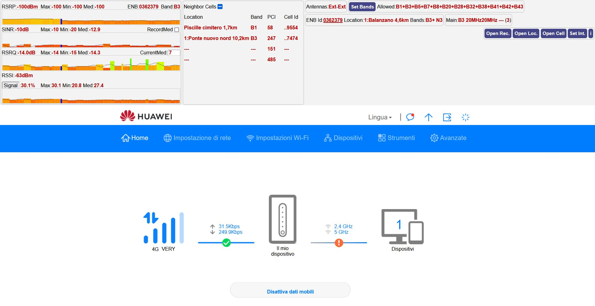
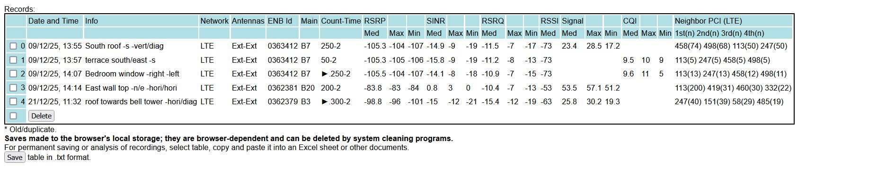

# Huawei router Hack

---

## English
- Huawei router Hack is a JavaScript code that monitors, records, and analyzes the main radio signal parameters of the LTE (4G) and NR (5G) networks received by the modem.
- With Huawei Hack, you can improve your modem's radio signal reception and thus improve performance simply and effectively.
- Huawei Hack allows you to find out which channels (or bands) are available in the surrounding area and helps you identify the best position for the modem to receive them or the best position, orientation and arrangement of any external antennas.

### Install and launch Huawei Hack:
1. Create/add a new Browser Favorites/Bookmarks and name it Hack;
2. Select all Hack JavaScript code, copy and paste it into the Bookmark URL box and save;
3. From Browser URL box open the router's address http://192.168.8.1 and log in;
4. On this open Browser page load Hack from Bookmarks.

- Huawei Hack was tested on a Huawei B818 4G router, Firefox, Edge, Chrome browsers. 
- Base code v5.0 by miononno.it - Advanced v1.0 by Riccardo Fanelli.

---

## Italiano
- Huawei router Hack è uno codice JavaScript che monitora, registra e analizza i principali parametri del segnale radio delle reti LTE(4G) e NR(5G) captate dal modem.
- Con Huawei Hack è possibile migliorare la ricezione del segnale radio del modem ed quindi migliorare le prestazioni in modo semplice ed efficace.
- Huawei Hack permette di sapere quali canali (o bande) sono a disponibili nella zona circostante e aiuta a individuare la miglior posizione del modem per captarli o la miglior posizione, orientamento e disposizione delle eventuali antenne esterne.

### Installare e avviare Huawei Hack:
1. Creare/aggiungere un nuovo Segnalibro/Preferito al Browser e nominarlo Hack;
2. Selezionare tutto il codice JavaScript Hack, copiarlo e incollarlo nel riquadro URL del Segnalibro e salvarlo;
3. Dall'URL del Browser aprire l'indirizzo http://192.168.8.1 del router e accedere;
4. In questa pagina aperta del Browser caricare Hack dai Segnalibri.

- Huawei Hack è stato testato su un router Huawei B818 4G, browser Firefox, Edge, Chrome.
- Codice base v5.0 di miononno.it - evoluzione v1.0 di Riccardo Fanelli.

---





```javascript
javascript:ftb();
function ha(i,h)
{
	try{document.getElementById(i).innerHTML=h}catch(e){}
}
function ro(n)
{
    return Math.round(n*10)/10;
}
function net(p)
{
    return p.slice(0,3)=="lte"?"lte":"nr";
}
function msg(e)
{
    console.log(e);
}
function tit(a)
{
    t=document.getElementById("tit").style;if(a){t.display="block";ha("tit",a)}else t.display="none";
}
function extractXML(t,d)
{
	try{return d.split("</"+t+">")[0].split("<"+t+">")[1]}catch(e){return e.message}
}
function _4GType(d)
{
	for(d1="",x=0;x<90;x++)tb=Math.pow(2,x),BigInt("0x"+d)&BigInt(tb)?d1+="B"+String(x+1)+"+":"";return d1.replace(/\++$/,"");
}
function loadbts()
{
    if(localStorage.getItem(stoname["bts"])===null)localStorage.setItem(stoname["bts"],JSON.stringify({}));    
    bts=JSON.parse(localStorage.getItem(stoname["bts"]));
    for(const[i,r]of Object.entries(bts_location))
        if(!(i in bts))bts[i]=[r[0],r[1]];else msg("Double BTS location in memory, ENB Id:"+i);
}
function loadnei()
{
    if(localStorage.getItem(stoname["nei"])===null)localStorage.setItem(stoname["nei"],JSON.stringify({}));    
    nei=JSON.parse(localStorage.getItem(stoname["nei"]));neisto=JSON.parse(JSON.stringify(nei));
    for(const[i,r]of Object.entries(neighbor_cell))
        if(!(i in nei))nei[i]=[r[0],r[1],r[2]];else msg("Double neighbor cell in memory, PCI:"+i);
}
function start()
{
    e1=document.getElementsByName("lte");e2=document.getElementsByName("nr");
    let x=new XMLHttpRequest;x.open("GET","/api/device/signal",!0),x.setRequestHeader("Content-type","application/json; charset=UTF-8"),x.send(),x.onload=function()
    {
        if(200===x.status)
        {
            signval["plmn"]=extractXML("plmn",x.responseText);/*get&set plmn&link*/
            state=signval["plmn"].slice(0,3);
            if(state=="222")
            {
                if("22201"==signval["plmn"])signval["plmn"]="2221";
                if("22299"==signval["plmn"])signval["plmn"]="22288";
                link="https://lteitaly.it/internal/map.php#bts="+signval["plmn"]+".";
            }
            else
                document.getElementById("link").setAttribute("href","https://www.cellmapper.net");
            /*defined lte/nr/nrrssi/enodeb_id*/
            defined["nr"]="undefined"!=typeof extractXML("nrrsrp",x.responseText),defined["lte"]="undefined"!=typeof extractXML("rsrp",x.responseText),defined["nrrssi"]="undefined"!=typeof extractXML("nrrssi",x.responseText),defined["enodeb_id"]="undefined"!=typeof extractXML("enodeb_id",x.responseText);
            ["lte","nr"].forEach(function(b){if(defined[b])defltenr.push(b)});
            for(l=e1.length,i=0;i<l;i++)/*set HTMLpage*/
                e1[i].style.display=defined["lte"]?"inline-block":"none";
            for(l=e2.length,i=0;i<l;i++)
                e2[i].style.display=defined["nr"]?"inline-block":"none";
            document.getElementById("force").style.display=defined["nr"]&&defined["lte"]?"inline-block":"none";
        }
        else
            msg("Err Signal:"+x.status);
    };
    boxcar=parseInt(gw/gt),gtm=parseInt(gt/2);
    loadbts();
    loadnei();
}
function currentData()
{
	if(suspend==1)return;
    try{document.getElementById("dhcp_mask").style.display="block",document.getElementById("dhcp_dns").style.display="block"}catch(e){}
/*  HUAWEI VARIABLES & FUNCTION
    start()        Huawei->(indipendent)plmn,nrrsrp,rsrp,nrrssi,enodeb_id*/
    Promise.all([
        getSignal(), /*Huawei->nrrsrp,nrrsrq,nrsinr,(nrrssi),(nrcqi0),(lte)rsrp,(lte)rsrq,(lte)sinr,(lte)rssi,(lte)cqi0,nrdlbandwidth,nrulbandwidth,(lte)dlbandwidth,(lte)ulbandwidth,band,nrearfcn,(lte)earfcn,enodeb_id,cell_id,pci,nei_cellid->..*/
        getStatus(), /*Huawei->(LTE band aggregation status)CurrentNetworkTypeEx->is4gp->..*/
        getAntenna(),/*Huawei->(antennas status)antenna1type+antenna2type->..*/
        getNetmode(),/*Huawei->(allowed bands status,indipendent)LTEBand*/
    ]).then(function()
    {         
        setEnodebMainbandBTS();/*..<-band,nrearfcn,lteearfcn,enodeb_id,cell_id<-Huawei*/
        neighborCell();        /*..<-pci,enodeb_id,cell_id,nei_cellid<-Huawei*/  
        medControl();
        medCalc();
        barGraph();
        titleBar();            /*..<-enodeb_id<-Huawei,..<-is4gp<-CurrentNetworkTypeEx<-Huawei*/
    },function(e)
    {
        msg(e);
    });
/*  clickLTEBandSelection() Huawei->(select bands in use,indipendent)
    clickStorage()          ..<-antenna1type,antenna2type,enodeb_id<-Huawei
    extractXML()            (subf for Huawei function)
    4GType()                (subf for Huawei function)*/
}
function getSignal()
{
    return new Promise((resolve,reject)=>
    {
        let x=new XMLHttpRequest;x.open("GET","/api/device/signal",!0),x.setRequestHeader("Content-type","application/json; charset=UTF-8"),x.send(),x.onload=function()
        {
            if(200===x.status)
            {
                signal=d=x.responseText;/*get&view and get*/
                for(l=signnam.length,i=0;i<l;i++)signval[signnam[i]]=extractXML(signnam[i].replace("lte",""),d),ha(signnam[i],signval[signnam[i]]);
                for(l=signnam2.length,i=0;i<l;i++)signval[signnam2[i]]=extractXML(signnam2[i].replace("lte",""),d);
                if(defined["nr"]&&!defined["nrrssi"]){ha("nrrssi","");signval["nrrssi"]="0"}
                for(i=defined["nr"]?0:5,l=defined["lte"]?10:5;i<l;i++)/*convert str->num nrrsrp||ltersrp>>nrcqr0||ltecqr0*/
                {
                    currval[signnam[i]]=parseFloat(signval[signnam[i]].replace(/[^0-9\.\-]/g,"")||-999)+(signval[signnam[i]].includes("gt")?1:signval[signnam[i]].includes("lt")?-1:0);
                    if(currval[signnam[i]]>999||currval[signnam[i]]<-999)currval[signnam[i]]=-999;
                    if(signval[signnam[i]].includes("&")||(currval[signnam[i]]==-999&&!signnam[i].includes("cqi0")))msg(signnam[i]+":"+signval[signnam[i]]);
                }
                defltenr.forEach(function(b)/*calc&view sign lte&nr*/
                {
                    currval[b+"sign"]=Math.round(((currval[b+"rsrp"]-min_rsrp)/(max_rsrp-min_rsrp)*balance_rsrp+(currval[b+"rsrq"]-min_rsrq)/(max_rsrq-min_rsrq)*balance_rsrq+(currval[b+"sinr"]-min_sinr)/(max_sinr-min_sinr)*balance_sinr+(currval[b+"rssi"]-min_rssi)/(max_rssi-min_rssi)*balance_rssi)*10)/10,signval[b+"sign"]=currval[b+"sign"]+"%",ha(b+"sign",signval[b+"sign"]);
                });
                currnei=[];if(signval["nei_cellid"])signval["nei_cellid"].match(/(?<=:)\d+/g).forEach(function(v,i){currnei[i]=v});/*list nei_cellid*/
                resolve();
            }
            else
                reject("Err Signal:"+x.status);
        };
    });
}
function getStatus()
{
    return new Promise((resolve,reject)=>
    {/*get&view*/
        let x=new XMLHttpRequest;x.open("GET","/api/monitoring/status",!0),x.setRequestHeader("Content-type","application/json; charset=UTF-8"),x.send(),x.onload=function(){if(200===x.status)is4gp=1011==extractXML("CurrentNetworkTypeEx",status=x.responseText),ha("mode",is4gp?"4G+":"---"),resolve();else reject("Err Status:"+x.status);}
    });
}
function getAntenna()
{
    return new Promise((resolve,reject)=>
    {/*get&view*/
        let x=new XMLHttpRequest;x.open("GET","/api/device/antenna_type",!0),x.setRequestHeader("Content-type","application/json; charset=UTF-8"),x.send(),x.onload=function(){if(200===x.status)d=antennatype=x.responseText,antenna1type=extractXML("antenna1type",d)=="1"?"Ext":"Int",antenna2type=extractXML("antenna2type",d)=="1"?"Ext":"Int",ha("a1",antenna2type),ha("a2",antenna2type),resolve();else reject("Err Antenna:"+x.status);}
    });
}
function getNetmode()
{
    return new Promise((resolve,reject)=>
    {/*get&view*/
        let x=new XMLHttpRequest;x.open("GET","/api/net/net-mode",!0),x.setRequestHeader("Content-type","application/json; charset=UTF-8"),x.send(),x.onload=function(){if(200===x.status)ha("allowed",_4GType(extractXML("LTEBand",netmode=x.responseText))),resolve();else reject("Err Netmode:"+x.status);}
    });
}
function setEnodebMainbandBTS()
{
    if(!defined["enodeb_id"])/*set&view enodeb&link*/
        mp=signval["cell_id"].indexOf("-"),mp>0?signval["enodeb_id"]=Number(signval["cell_id"].substr(0,mp)):(hex=Number(signval["cell_id"]).toString(16),hex2=hex.substring(0,hex.length-2),signval["enodeb_id"]=parseInt(hex2,16).toString().padStart(7, "0"));
    ha("enodeb_id",signval["enodeb_id"]);if(state==222)document.getElementById("link").setAttribute("href",link+signval["enodeb_id"].replace(/^0+/,""));
    defltenr.forEach(function(b)
    {/*set&view mainband*/
        bb=b=="lte"?"B":"N";
        if(b=="lte")/*LTE->"<band>3</band>"*/
            if(!isNaN(signval["band"]))signval[b+"main"]=bb+signval["band"];
        if(!signval[b+"main"]&&signval["band"].includes("("))/*LTE&NR->1st B&N of"<band>..(B3)..(N78)..</band>"*/
        {
            a=signval["band"].match(/(?:\()[^\(\)]*?(?:\))/g);
            for (i=0;i<a.length;i++)
                if((a[i].includes(bb))&&(/\d/).test(a[i])){signval[b+"main"]=bb+a[i].replace(/[^0-9]/g,"");break}
        }
        if(b=="nr"&&!signval[b+"main"])/*LTE&NR->UL of"<..earfcn>DL:.. UL:..</..earfcn>"*/
        {
            s=signval[b+"earfcn"].split("UL:")[1];
            for(const[k,n]of Object.entries(earfcn[b]))if("undefined"!=typeof n)if(s>n[2]&&s<n[3]){signval[b+"main"]=bb+k.slice(2);break}
        }
        if(!signval[b+"main"])signval[b+"main"]="---";ha(b+"main",signval[b+"main"]);
        if(!recstatus[b]){ha(b+"band",signval[b+"main"]);ha(b+"enb",signval["enodeb_id"])}/*view enb&main*/
        enbmainchange[b]=enbmainold[b]!=signval["enodeb_id"]+signval[b+"main"];enbmainold[b]=signval["enodeb_id"]+signval[b+"main"];/*set enb+main continuity*/
    });
    b=document.getElementById("btsb").style;/*view BTSlocation*/
	if(signval["enodeb_id"] in bts)
	{
        b.display="inline";
		ha("namebts",bts[signval["enodeb_id"]][0]);
        ha("bandsbts",bts[signval["enodeb_id"]][1]);
	}
    else
    {
        ha("namebts","<li><button onclick='clickStorage(\"bts\",true)'>Add Loc.</button></li>");
        b.display="none";
    }
}
function neighborCell()
{
    if(enbmainchange["lte"])/*auto-save*/
    {
        pci=signval["pci"];
        if(pci&&pci!="0"&&signval["ltemain"].slice(1)!="0")
        {
            if(pci in neisto&&signval["cell_id"]+signval["enodeb_id"]+signval["ltemain"]!=neisto[pci][0]+neisto[pci][1]+neisto[pci][2])
            {
                msg("A new neighboring cell has been detected to replace the old one; PCI:"+pci);
                Object.defineProperty(nei,pci+"*old",Object.getOwnPropertyDescriptor(nei,pci));delete nei[pci];
                Object.defineProperty(neisto,pci+"*old",Object.getOwnPropertyDescriptor(neisto,pci));delete neisto[pci];
            }
            if(!(pci in neisto)&&pci in nei)
                if(pci in nei)delete nei[pci];
            if(!(pci in nei))
            {
                nei[pci]=[signval["cell_id"],signval["enodeb_id"],signval["ltemain"]]; 
                neisto[pci]=[signval["cell_id"],signval["enodeb_id"],signval["ltemain"]];
                localStorage.setItem(stoname["nei"],JSON.stringify(neisto));
            }
        }
    }
    if(!neistatus)/*view*/
        return;
    if(neivis)neivis--;
    tb=document.getElementById('neitab');
    if(signval["nei_cellid"])
    {
        h="",neivis=3,tb.style.opacity=1;
        currnei.forEach(function(v)
        {
            if(v in nei){b0=nei[v][0]?".."+nei[v][0].slice(-4):"---",b1=nei[v][1]?nei[v][1]:"---",b2=nei[v][2]?nei[v][2]:"---"}else{b0="---",b1="---",b2="---"}
            if(neistatus==1)
                h+="<tr><td>"+b1+"</td><td>"+b2+"</td><td>"+v+"</td></tr>";
            else if(recstatus["nr"]>=1||recstatus["lte"]>=1)
                h+="<tr><td>"+b1+"<span name='recnei'style='position:absolute;left:5em'></span></td><td>"+b2+"</td><td>"+v+"</td><td>"+b0+"</td></tr>";
            else
                h+="<tr><td>"+(b1 in bts?bts[b1][0].substring(0,25).replace(/[^a-zA-Z]+$/,""):b1)+"</td><td>"+b2+"</td><td>"+v+"</td><td>"+b0+"</td></tr>";
        });
        tb.innerHTML=h;
    }
    else if(neivis)
        tb.style.opacity=0.4;
    else 
        tb.innerHTML="";
}
function medControl()
{
    recvalnot["nr"]=recvalnot["lte"]=false;
    for(const[p]of Object.entries(currval))
    {
        b=net(p);
        if(defined[b]) 
        {
/*rec*/     if(currval[p]==-999&&p!=notselsign[b])recvalnot[b]=true;
/*cur*/     if(!p.includes("rssi"))if(curmed[p].unshift(currval[p]+(currval[p]==-999?"|b":enbmainchange[b]?"|a":"|"))>boxcar*2)curmed[p].pop();
        }
    }
    defltenr.forEach(function(b)
    {
/*rec*/ if(recstatus[b]==1||recstatus[b]==2)
        {
            if(reccount[b]>=recmaxcount[b])
            { 
                c=document.getElementById("rec"+b);c.checked=false;clickRecMed(c,b);
            }
            else if(signval["enodeb_id"]!=recenb[b]||signval[b+"main"]!=recband[b]||recvalnot[b])
            {
                recstatus[b]=2;
                recpause[b]="►.";
                if(signval["enodeb_id"]!=recenb[b])recenbpause[b]="►.";
                if(signval[b+"main"]!=recband[b])recbandpause[b]="►.";
                ha(b+"enb",recenb[b]+recenbpause[b]);
                ha(b+"band",recband[b]+recbandpause[b]);
                ha("medcount"+b,reccount[b]+"../");
            }
            else
            {
                recstatus[b]=1;reccount[b]++;
                ha("medcount"+b,reccount[b]+recpause[b]+"/");
            }
        }
/*cur*/ else if(!recstatus[b])
        {
            if(!curmaxcount[b])
            {
                if(curstatus[b]==1)curstatus[b]=2;
                ha("medcount"+b,"");
            }
            else
            {
                for(i=0,l=Math.min(curmaxcount[b],curmed[b+"rsrp"].length);i<l&&!curmed[b+"rsrp"][i].split("|")[1];i++);
                if(i<curmaxcount[b]-1)
                {
                    curstatus[b]=2;
                    ha("medcount"+b,i+1-curmaxcount[b]+"/")
                }
                else
                {
                    curstatus[b]=1;
                    ha("medcount"+b,"")
                }
            }
            if(curstatus[b]==2){curstatus[b]=0;ha("med"+b+"rsrp","");ha("med"+b+"rsrq","");ha("med"+b+"sinr","");ha("med"+selsign[b],"")}
        }
    });
}
function medCalc()
{
    for(const[p]of Object.entries(currval)) 
    {
        b=net(p);
        if(defined[b])
/*rec*/     if(recstatus[b]==1)
            {
                recmed[p]=(recmed[p]*(reccount[b]-1)+currval[p])/reccount[b];
                if(!p.includes("rssi"))
                {
                    if(currval[p]>recmax[p])recmax[p]=currval[p];if(currval[p]<recmin[p])recmin[p]=currval[p];
                    if(p!=notselsign[b])ha("med"+p,"Max:<span class='val'>"+recmax[p]+"</span> Min:<span class='val'>"+recmin[p]+"</span> Med:<span class='val'>"+ro(recmed[p])+"</span>");
                }
                else if(b=="lte"||(b=="nr"&&defined["nrrssi"]))
                    ha("med"+p,"Med:<span class='val'>"+ro(recmed[p])+"</span>");
            }
/*curr*/    else if(!recstatus[b]&&curstatus[b]==1&&!p.includes("rssi"))
            {
                for (ma=-999,mi=999,me=0,i=0;i<curmaxcount[b];i++)
                {
                    if(curmed[p][i].split("|")[1]=="b"){ma="";mi="";me="";break}
                    a=parseFloat(curmed[p][i].split("|")[0]);
                    if(a>ma)ma=a;if(a<mi)mi=a;me+=a;
                }
                curmedsign[b]=me?ro(me/i):"";
                if(p!=notselsign[b])ha("med"+p,"Max:<span class='val'>"+ma+"</span> Min:<span class='val'>"+mi+"</span> Med:<span class='val'>"+curmedsign[b]+"</span>");
            }
    }
    currnei.forEach(function(v,k)/*recnei*/
    {
        c="";
        defltenr.forEach(function(b)
        {
            if(recstatus[b]==1)
            {
                recnumnei[b][v]=(v in recnumnei[b])?recnumnei[b][v]+1:1;
                c+=(c?"&ensp;":"")+recnumnei[b][v];
            }
        });
        if(c&&neistatus==2)document.getElementsByName("recnei")[k].innerHTML=c;
    });
}
function barGraph()
{
    for(const[p,vv]of Object.entries(currval))
    {
        b=net(p);
        if(p!="nrrssi"&&p!="lterssi"&&defined[b])
        {
            bb=p.slice(b.length),min=window["min_"+bb],max=window["max_"+bb];
/*current*/ v=vv;abc=(enbmainchange[b]?"|a":"|")+(signval[p].includes("lt")||v<min?"|b":signval[p].includes("gt")||v>max?"|c":"|");
            if(v<min)v=min;if(v>max)v=max;
            if(currgra[p].unshift(v+abc)>boxcar)currgra[p].pop();
/*recmed*/  if(recstatus[b])if(recmedgra[p].unshift(recstatus[b]==1?true:false).length>boxcar)recmedgra[p].pop();
/*graph*/   if(p!=notselsign[b])
            {
                for(html='',l=currgra[p].length,x=0;x<l;x++)
                {
                    px=1+gt*x;
/*current*/         a=currgra[p][x].split("|"),c=(a[0]-min)/(max-min);
                    d=c*100,co=a[1]=="a"?"blue":a[2]=="b"?"":a[2]=="c"?"green":"rgb("+5*Math.round(d<50?50:100-d)+" "+5*Math.round(d>50?50:d)+" 0)";
                    html+='<line x1="'+px+'"y1="'+gh+'"x2="'+px+'"y2="'+(gh-c*gh-1)+'"stroke="'+co+'"stroke-width="'+gt+'"/>';
/*curmed*/          if(!recstatus[b]&&curmaxcount[b])
                    {
                        for(me=0,i=x,ll=Math.min(x+curmaxcount[b],curmed[p].length);i<ll&&!curmed[p][i].split("|")[1];i++)
                        {
                            if(curmed[p][Math.min(i+1,curmed[p].length)].split("|")[1]=="b")break;
                            me+=parseFloat(curmed[p][i].split("|")[0]);
                        }
                        if(i>=x+curmaxcount[b]-1)
                        { 
                            me=me/(i-x);if(me>max)me=max;if(me<min)me=min;
                            py=gh-(me-min)/(max-min)*gh;
                            html+='<line x1="'+px+'"y1="'+(py-1)+'"x2="'+px+'"y2="'+py+'"stroke="black"stroke-width="'+gtm+'"/>';
                        }  
                    }
/*recmed*/          if(recmedgra[p][x])
                    {
                        me=recmed[p];if(me>max)me=max;if(me<min)me=min;
                        py=gh-(me-min)/(max-min)*gh;
                        html+='<line x1="'+px+'"y1="'+(py-1)+'"x2="'+px+'"y2="'+py+'"stroke="black"stroke-width="'+gtm+'"/>';
                    }
                }
                document.getElementById("b"+p).innerHTML='<svg version="1.1"viewBox="0 0 '+gw+' '+gh+'"width="'+gw+'"height="'+gh+'"preserveAspectRatio="xMaxYMax slice"style="border:1px solid #ccc;padding:1px;margin:-6px 0 -10px;width:'+gw+'px;">'+html+'</svg>';
            }
        }
    }
}
function titleBar()
{
    let t=!isNaN(signval["enodeb_id"])?(signval["enodeb_id"] in bts?bts[signval["enodeb_id"]][0].substring(0,16).replace(/[^a-zA-Z]+$/,""):signval["enodeb_id"]):"";
    t+="|"+signval["ltemain"].slice(1)+(is4gp?"+":"")+(defined["nr"]?" "+signval["nrmain"].slice(1):"")+"|";
    defltenr.forEach(function(b)
    {
        if(recstatus[b]>0)
            t+=reccount[b]+((signval["enodeb_id"]!=recenb[b]||signval[b+"main"]!=recband[b]||recvalnot[b])?"..":recpause[b])+" ";
        else if(curstatus[b]==1)
            t+=curmedsign[b].toFixed(0)+"%";
        else
            t+=currval[b+"sign"].toFixed(0)+"%";
    });
    document.title=t;
}
function clickRecMed(a,b)
{
	if(a.readOnly)a.checked=a.readOnly=false;else if(!a.checked)a.readOnly=a.indeterminate=true;
    c=document.getElementById("count"+b),ss=document.getElementById("selsign"+b),msc=document.getElementById("medsetcount"+b);
	if(a.checked)
	{
        recstatus[b]=1;
		recenb[b]=signval["enodeb_id"],recband[b]=signval[b+"main"],ha(b+"enb",recenb[b]+"►"),ha(b+"band",recband[b]+"►");
        c.firstChild.data="Count:",msc.value=recmaxcount[b],msc.setAttribute("onblur","clickNumRecMed(this,'"+b+"')"),ss.disabled=true;
        if(neistatus==2)ha("neitaps","<tr><td>ENB Id&emsp;&ensp;RecNum PCI</td><td>Band</td><td>PCI</td><td>Cell Id</td></tr>");
	}
	else if(a.indeterminate)
    {
        recstatus[b]=3;
        ha("medcount"+b,reccount[b]+"■/"),ha("store"+b,"<button onclick='clickStorage(\"rec\",\""+b+"\")'>Save Rec.</button>");
        recant=antenna1type+"-"+antenna2type;
        for(r=[["","","",""],[0,0,0,0]],i=0;i<4;i++)for(const[k,v]of Object.entries(recnumnei[b]))if(!r[0].includes(k)&&v>r[1][i]){r[0][i]=k;r[1][i]=v}
        for(recneires[b]="",i=0;i<4;i++)if(r[0][i])recneires[b]+=r[0][i]+"("+r[1][i]+") ";recneires[b]=recneires[b].slice(0,-1);
        if(neistatus==2)ha("neirec"+b,"RecNum "+(b=="nr"?"NR ":"")+"PCI:<span class='val'>"+recneires[b]+"</span>");
    }
	else
	{
        recstatus[b]=0;
        reccount[b]=0,recpause[b]="",recenbpause[b]=recbandpause[b]="►",recmaxcount[b]=999;
        for(const[p]of Object.entries(currval))if(net(p)==b){if(!p.includes("rssi")){recmax[p]=-999,recmin[p]=999,recmedgra[p].length=0}recmed[p]=0;}
        Object.keys(recnumnei[b]).forEach(i=>delete recnumnei[b][i]);
        ha("med"+b+"rsrp",""),ha("med"+b+"rsrq",""),ha("med"+b+"sinr",""),ha("med"+b+"rssi",""),ha("med"+selsign[b],"");
        c.firstChild.data="CurrentMed:",ha("medcount"+b,""),msc.value=curmaxcount[b]?curmaxcount[b]:"",msc.setAttribute("onblur","clickNumCurMed(this,'"+b+"')"),ha("store"+b,""),ss.disabled=false;
        if(neistatus==2&&!recstatus["nr"]&&!recstatus["lte"])ha("neitaps","<tr><td>Location</td><td>Band</td><td>PCI</td><td>Cell Id</td></tr>");
        ha("neirec"+b,"")
	}
}
function clickNei(a)
{
    if(a.readOnly)a.checked=a.readOnly=false;else if(!a.checked)a.readOnly=a.indeterminate=true;
    n=document.getElementById('nei').style,s=document.documentElement.style;
    ha('neitab',"");
    function td(a,b,c,d)
    {
        s.setProperty("--neitd1",a+"%"),s.setProperty("--neitd2",b+"%"),s.setProperty("--neitd3",c+"%"),s.setProperty("--neitd4",d+"%");
    }
    if(a.checked)
	{
        neistatus=1,ee=defined["lte"]?document.getElementsByName("lte")[0]:document.getElementsByName("nr")[0],n.height=ee.clientHeight-2*parseInt(getComputedStyle(ee).padding)+"px";
        td(44,28,28,0),ha("neitaps","<tr><td>ENB Id</td><td>Band</td><td>PCI</td></tr>");
    }
    else if(a.indeterminate)
    {
        neistatus=2,n.width="24em";
        td(56,14,14,16),ha("neitaps","<tr><td>"+(recstatus["nr"]||recstatus["lte"]?"ENB Id&emsp;&ensp;RecNum PCI":"Location")+"</td><td>Band</td><td>PCI</td><td>Cell Id</td></tr>");
        defltenr.forEach(function(b){if(recstatus[b]==3)ha("neirec"+b,"RecNum "+(b=="nr"?"NR ":"")+"PCI:<span class='val'>"+recneires[b]+"</span>")});
    }
    else
    {
        neistatus=0,n.width="12em",n.height="2em";
        td(0,0,0,0),ha("neitaps","");
        ha("neireclte",""),ha("neirecnr","");
    }
}
function clickLTEBandSelection(bs)/*only LTE?*/
{
	var band;if(main&&(main=null),0==arguments.length){if((band=prompt("Please input LTE bands number allowed separated by '+', add 'm' to set main (example 1+3+20 or m3+7)(the main setting is cyclically reworked by the modem). For use every supported bands, write 'AUTO'.","AUTO"))&&(band=band.toLowerCase()),null==band||""===band)return}else var band=arguments[0];var bs=band.split("+"),ltesum=0;if("AUTO"===band.toUpperCase())ltesum="7FFFFFFFFFFFFFFF";else{for(var i=0;i<bs.length;i++){if(-1!=bs[i].toLowerCase().indexOf("m")&&(bs[i]=bs[i].replace("m",""),main=bs[i]),"AUTO"===bs[i].toUpperCase()){ltesum="7FFFFFFFFFFFFFFF";break}ltesum+=Math.pow(2,parseInt(bs[i])-1)}ltesum=ltesum.toString(16)}if(main)return _2ndrun=bs,void ltebandselection(String(main));suspend=1,tit("! PLEASE WAIT !"),xh=new XMLHttpRequest,xh.open("GET","/html/home.html",!0),xh.setRequestHeader("Content-type","application/json; charset=UTF-8"),xh.send(),xh.onload=function(){if(200===xh.status){var datas=xh.responseText.split('name="csrf_token" content="'),token=datas[datas.length-1].split('"')[0],nw="00";document.getElementById("force4g").checked&&(nw="03"),msg(nw),setTimeout((function(){xp=new XMLHttpRequest,xp.open("POST","/api/net/net-mode",!0),xp.setRequestHeader("Content-type","application/json; charset=UTF-8"),xp.setRequestHeader("__RequestVerificationToken",token),cmd="<request><NetworkMode>"+nw+"</NetworkMode><NetworkBand>3FFFFFFF</NetworkBand><LTEBand>"+ltesum+"</LTEBand></request>",xp.send(cmd),xp.onload=function(){200===xp.status?(ha("band",'<span style="color:green;">OK</span>'),_2ndrun?window.setTimeout((function(){ltebandselection(_2ndrun.join("+")),_2ndrun=!1}),2e3):(suspend=0,tit())):msg("Err net-mode:"+xp.status)}}),2e3)}else msg("Err /home.html(token):"+xh.status)}
}
function clickNumRecMed(a,b)
{
    recmaxcount[b]=parseInt(a.value=a.value?a.value:recmaxcount[b]);
}
function clickNumCurMed(a,b)
{
    curmaxcount[b]=parseInt(a.value=!a.value?"":a.value>boxcar?boxcar:a.value)||0;
}
function clickSelSign(a,b)
{
    document.getElementById(selsign[b]).setAttribute("id",a);
    document.getElementById("med"+selsign[b]).setAttribute("id","med"+a);
    document.getElementById("b"+selsign[b]).setAttribute("id","b"+a);
    notselsign[b]=selsign[b];selsign[b]=a;
}
function clickTime()
{
    do{t=prompt("Please input interval time (1 to 600 seconds)",itime/1000);if(t==null)return}while(t==""||t<1||t>600||isNaN(t))
    itime=parseFloat(ro(t))*1000;clearInterval(interval);interval=window.setInterval(currentData,itime);
}
function clickInfo()
{
    alert("--- General technical information\nRSRP: Useful signal strength of the cell to which you are connected.\nRSSI: Total signal strength of the useful signal+interference from signals from other cells+noise from other sources.\nRSRQ: Implicit signal quality from the RSRP/RSSI ratio, which indicates the prevalence of the useful signal over the others.\nSINR: Explicit signal quality from the ratio of the useful signal strength to interference+noise strengths.\nCQI: Evaluation of the quality of the signal in use calculated by the modem and sent to the BTS to adapt the modulation and speed of the data transmission.\nSignal: Signal quality evaluation calculated by balancing the underlying parameters.\nCell Id/PCI: Numerical identification of a radio signal at a specific frequency or band transmitted and received by an antenna/Short identification number of a cell in a limited area.\n\n--- SIGNAL QUALITY BALANCED\nsignal_balance_rsrp="+signal_balance_rsrp+"%\nsignal_balance_sinr="+signal_balance_sinr+"%\nsignal_balance_rsrq="+signal_balance_rsrq+"%\nsignal_balance_rssi="+signal_balance_rssi+"%\n\n--- SIGNAL VALUE LIMITS (Usual)\nmax_rsrp="+max_rsrp+"dBm min_rsrp="+min_rsrp+"dBm\nmax_sinr="+max_sinr+"dB min_sinr="+min_sinr+"dB\nmax_rsrq="+max_rsrq+"dB min_rsrq="+min_rsrq+"dB\nmax_rssi="+max_rssi+"dBm min_rssi="+min_rssi+"dBm\n\n--- BTS LOCATION\n...\n\n--- NEIGHBOR CELL\n...\n\nTo change parameter values, edit the Hack's script.");
}
function clickStorage(tipo,b)
{
    sn=stoname[tipo];
    if(tipo=="rec")
    {
        wwi=1650;
        savq=["Please input new record info (optional)."],savl=[35];        
        html1="Records:",html2="For permanent saving or analysis of recordings, select table, copy and paste it into an Excel sheet or other documents.";
        re1=[["","Date and Time","Info","Network","Antennas","ENB Id","Main","Count-Time","RSRP","","","SINR","","","RSRQ","","","RSSI","Signal","","","CQI","","","Neighbor PCI (LTE)"],["","","","","","","","","Med","Max","Min","Med","Max","Min","Med","Max","Min","Med","Med","Max","Min","Med","Max","Min","1st(n) 2nd(n) 3rd(n) 4th(n)"]];
        re2=[];
        if(localStorage.getItem(sn)===null)localStorage.setItem(sn,JSON.stringify([]));re3=JSON.parse(localStorage.getItem(sn));
    }
    if(tipo=="bts")
    {
        wwi=800;
        savq=["Please input new BTS location name (optional).\nTo get info about BTS locations, search for 'Enb Id' on the websites cellmapper.net or lteitaly.it.","Input availables BTS bands (optional)."],savl=[35,35];
        html1="Locations:", html2="For permanent saving of locations, add them manually into the Hack script (grey in table); to get info about BTS locations search on <a href='https://www.cellmapper.net' target='_blank'>cellmapper.net</a>, <a href='https://celltracker.it' target='_blank'>Celltracker.it</a> or <a href='https://lteitaly.it' target='_blank'>lteitaly.it</a> (registration recommended).";
        re1=[["ENB Id","BTS location name","Availables bands"]];
        re2=JSON.parse(JSON.stringify(bts_location));
        re3=JSON.parse(localStorage.getItem(sn));
        enb=signval["enodeb_id"];
    }
    if(tipo=="nei")
    {
        wwi=600;
        html1="Neighbor cells:", html2="Saving and updating reference data for neighboring cells (PCI) is automatic when connecting to them; to save them manually or permanently add them into the Hack script (grey in table); <b>the cell number ​​may be subject to change by the network operator</b>; to get info about Cells search on <a href='https://www.cellmapper.net' target='_blank'>cellmapper.net</a> or <a href='https://celltracker.it' target='_blank'>Celltracker.it</a>.";
        re1=[["PCI","Cell Id","ENB Id","Band"]];
        re2=JSON.parse(JSON.stringify(neighbor_cell));
        re3=JSON.parse(localStorage.getItem(sn));
    }
    w=window.open("","Hack store","width="+wwi+",height=800");w.focus();w.document.body.innerHTML="";
    w.tab=function()
    {
        t="";
        if(re1)for(const[a]of Object.entries(re1)){t+="<tr bgcolor='B0E0E6'>";for(const[,c]of Object.entries(re1[a]))t+="<td>"+c+"</td>";t+="</tr>";}
        if(re2)for(const[a]of Object.entries(re2)){t+="<tr bgcolor='#C0C0C0'><td>"+a+(a in re3?"*":"")+"</td>";for(const[,c]of Object.entries(re2[a]))t+='<td>'+c+'</td>';t+='</tr>';}
        if(re3)for(const[a]of Object.entries(re3)){t+="<tr><td bgcolor='B0E0E6'><input type='checkbox'name='c'value='"+a+"'> "+a+(a in re2?"*":"")+"</td>";for(const[,c]of Object.entries(re3[a]))t+='<td>'+c+'</td>';t+='</tr>'}
        t+="<tr><td bgcolor='B0E0E6'><input id='cc'type='checkbox'onclick='c=document.getElementsByName(\"c\");for(i in c)c[i].checked=this.checked;'></td><td><button onclick='delsto()'>Delete</button></td></tr>";
        tab=document.createElement('table');tab.innerHTML=t;tb=w.document.getElementById('tb');tb.replaceChildren(tab);
    };
    w.delsto=function()
    {
        for(c=w.document.getElementsByName('c'),i=c.length-1;i>=0;i--)
            if(c[i].checked)
            {
                delete re3[c[i].value];
                if(tipo=="rec")localStorage.setItem(sn,JSON.stringify(re3.filter(n=>n!=null)));
                if(tipo=="bts"){localStorage.setItem(sn,JSON.stringify(re3));loadbts(sn)}
                if(tipo=="nei"){localStorage.setItem(sn,JSON.stringify(re3));loadnei(sn)}
            }
        w.document.getElementById("cc").checked=false;
        w.tab();
    };
    w.savtxt=function()
    {
        r="";re1.forEach(function(c){r+=c+"\n"});b=new Blob([(r+"\n- In script -\n"+JSON.stringify(re2)+"\n\n- In local storage -\n"+JSON.stringify(re3)).replaceAll("],","],\n")],{type:"text/plain"});
        l=document.createElement('a');l.href=URL.createObjectURL(b);l.download=sn+".txt";l.click();
    };
    w.document.write("<!DOCTYPE html><html><style>td{padding:2px}table{border:2px solid black}</style><body>"+html1+"<br><span id='tb'></span><b>Saves made to the browser's local storage; they are browser-dependent and can be deleted by system cleaning programs.</b><br>"+html2+"<br><button onclick='savtxt()'>Save</button> table in .txt format.</body></html>");
    w.tab();
    if(b)setTimeout(()=>
    {
        for(var inf=[],l=savq.length,i=0;i<l;i++)do{inf[i]=w.prompt(savq[i]+"\nMax "+savl[i]+" char.");if(inf[i]===null)return}while(inf[i].length>savl[i]);
        if(tipo=="rec")
        {
            d=new Date();t=d.toLocaleString(navigator.language,{dateStyle: 'short', timeStyle: 'short'});
            rcp=(recpause[b]?"►.":"")+reccount[b];
            if(selsign[b]==b+"cqi0"){rmes=rmis=rmas="";rmec=ro(recmed[b+"cqi0"]);rmic=recmin[b+"cqi0"];rmac=recmax[b+"cqi0"]}else{rmec=rmic=rmac="";rmes=ro(recmed[b+"sign"]);rmis=ro(recmin[b+"sign"]);rmas=ro(recmax[b+"sign"])}
            nr=[t,inf[0],b.toUpperCase(),recant,recenb[b],recband[b],rcp+"-"+(itime/1000),ro(recmed[b+"rsrp"]),recmax[b+"rsrp"],recmin[b+"rsrp"],ro(recmed[b+"sinr"]),recmax[b+"sinr"],recmin[b+"sinr"],ro(recmed[b+"rsrq"]),recmax[b+"rsrq"],recmin[b+"rsrq"],ro(recmed[b+"rssi"]),rmes,rmas,rmis,rmec,rmac,rmic,recneires[b]];
            re3.push(nr);
        }
        if(tipo=="bts")
        {
            bts[enb]=[inf[0],inf[1]];
            re3[enb]=[inf[0],inf[1]];
        }
        localStorage.setItem(sn,JSON.stringify(re3));
        w.tab();
    },99);
}
function ftb()
{
	document.body.insertAdjacentHTML("afterbegin",'
	<style>
    :root
    {
        --neitd1:0;
        --neitd2:0;
        --neitd3:0;
        --neitd4:0;
    }
    .val,.vali,#enodeb_id
	{
		color:#b00;
		font-weight:bold;
	}
    .vali
    {
        height:11px;
        width:28px;
        font-family:inherit;
        font-size:inherit;
    }
    #enodeb_id
	{
        text-decoration:underline;
	}
    select
    {
        height:20px;
        appearance:none;
        border-radius:2px;
        font-family:inherit;
        font-size:inherit;
    }
    #nei
    {
        position:relative;
        width:12em;
        height:2em;
        overflow:hidden; 
    }
    .nei
    {
        width:100%;
        border-collapse:collapse;
    }
    .nei td:nth-child(1) 
    {
        width:var(--neitd1);
    }
    .nei td:nth-child(2) 
    {
        width:var(--neitd2);
    }
    .nei td:nth-child(3) 
    {
        width:var(--neitd3);
    }
    .nei td:nth-child(4) 
    {
        width:var(--neitd4);
    }
    .f,.f2
	{
		border:1px solid #bbb;
		border-radius:5px;
		padding:2px;
		line-height:2em;
		margin:2px;
	}
    .f
    {
        float:left;
        position:relative;
        display:inline;
    }
    .f2
    {
        float:right;
    }
	li
	{
		display:inline;
	}
	#tit
	{
		color:white;
		background-color:#888;
		margin:2px;
		padding:2px;
		border-radius:5px;
		display:none;
		text-align:center;
		font-weight:bold;
	}
    .med
    {
        position:absolute;
        left:8em;
    }
    button
    {
        font-weight:bold;
        background-color:#448;
        border:none;
        color:white;
        padding:5px;
        border-radius:5px;
    }
	</style>

	<div style="display:block;overflow:auto;position:relative">
	<div id="tit"></div>
    <div name="lte" style="display:none" class="f">
    RSRP:<span id="ltersrp" class="val"></span><span id="medltersrp" class="med"></span><span style="float:right">ENB:<span id="lteenb" class="val"></span>&ensp;Band:<span id="lteband" class="val"></span></span><div id="bltersrp"></div>
    SINR:<span id="ltesinr" class="val"></span><span id="medltesinr" class="med"></span><span style="float:right">RecordMed<input type="checkbox" id="reclte" onclick="clickRecMed(this,\'lte\');"></span><div id="bltesinr"></div>
	RSRQ:<span id="ltersrq" class="val"></span><span id="medltersrq" class="med"></span><span style="float:right" id="countlte">RecordMed:<span id="medcountlte" class="val"></span><input id="medsetcountlte" class="vali" maxlength="4" onkeypress="return(event.charCode>=48&&event.charCode<=57);" onblur="clickNumCurMed(this,\'lte\')" onfocus="this.value=\'\';"></span><div id="bltersrq"></div>
    RSSI:<span id="lterssi" class="val"></span><span id="medlterssi" class="med"></span><span style="float:right" id="storelte"></span><br>
    <select id="selsignlte"onchange="clickSelSign(this.value,\'lte\')"><option value="ltesign">Signal</option><option value="ltecqi0">CQI</option></select>:<span id="ltesign" class="val"></span><span id="medltesign" class="med"></span><div id="bltesign"></div>
    </div>
	<div name="nr" style="display:none" class="f">
	RSRP:<span id="nrrsrp" class="val"></span><span id="mednrrsrp" class="med"></span><span style="float:right">ENB:<span id="nrenb" class="val"></span>&ensp;Band:<span id="nrband" class="val"></span></span><div id="bnrrsrp"></div>
	SINR:<span id="nrsinr" class="val"></span><span id="mednrsinr" class="med"></span><span style="float:right">RecordMed<input type="checkbox" id="recnr" onclick="clickRecMed(this,\'nr\');"></span><div id="bnrsinr"></div>
    RSRQ:<span id="nrrsrq" class="val"></span><span id="mednrrsrq" class="med"></span><span style="float:right" id="countnr">RecordMed:<span id="medcountnr" class="val"></span><input id="medsetcountnr" class="vali" maxlength="4" onkeypress="return(event.charCode>=48&&event.charCode<=57);" onblur="clickNumCurMed(this,\'nr\')" onfocus="this.value=\'\';"></span><div id="bnrrsrq"></div>
    RSSI:<span id="nrrssi" class="val"></span><span id="mednrrssi" class="med"></span><span style="float:right" id="storenr"></span><br>
    <select id="selsignnr" onchange="clickSelSign(this.value,\'nr\')"><option value="nrsign">Signal</option><option value="nrcqi0">CQI</option></select>:<span id="nrsign" class="val"></span><span id="mednrsign" class="med"></span><div id="bnrsign"></div>
	</div>
    <div id="nei" class="f">
    <li>Neighbor LTE Cells<input type="checkbox" id="neifor" onclick="clickNei(this);"></li>
    <table id="neitaps" class="nei"></table><table id="neitab" class="nei val"></table>
    <span style="position:absolute;bottom:0"><span id="neireclte"></span><br><span id="neirecnr"></span></span>
    </div>
    <div class="f">
	<li>Antennas:<span id="a1" class="val"></span>-<span id="a2" class="val"></span></li>
	</div>
<!-- </div><div style="display:block;overflow:auto;position:relative"> -->
	<div class="f">
    <li id="force" style="display:none">Force Set 4G<input type="checkbox" id="force4g"></li>
    <li><button class="bot" onclick="clickLTEBandSelection()">Set Bands</button></li>
	<li>Allowed:<span id="allowed" class="val"></span></li>
	</div>
	<div class="f">
	<li>ENB Id:<a id="link" target="lteitaly" href="#"><span id="enodeb_id">#</span></a></li>
    <li>Location:<span id="namebts" class="val"></span></li>
    <li id="btsb" style="display:none">Bands:<span id="bandsbts" class="val"></span></li>
	</div>
	<div class="f">
 	<li name="lte" style="display:none">Main:<span id="ltemain" class="val"></span> <span id="ltedlbandwidth" class="val"></span><span id="lteulbandwidth" class="val"></span></li>
    <li name="lte" style="display:none" id="mode" class="val"></li>
    <li name="nr" style="display:none">NR Main:<span id="nrmain" class="val"></span> <span id="nrdlbandwidth" class="val"></span><span id="nrulbandwidth" class="val"></span></li>
	<li>(<span id="band" class="val"></span>)</li>
	</div>
    <div class="f2">
    <li><button onclick="clickStorage(\'rec\')">Open Rec.</button></li>
    <li><button onclick="clickStorage(\'bts\')">Open Loc.</button></li>
    <li><button onclick="clickStorage(\'nei\')">Open Cell</button></li>
    <li><button onclick="clickTime()">Set Int.</button></li>
    <li><button onclick="clickInfo()">i</button></li>
    </div>
	</div>
    ');
}
/*current*/
signnam=["nrrsrp","nrrsrq","nrsinr","nrrssi","nrcqi0","ltersrp","ltersrq","ltesinr","lterssi","ltecqi0","nrdlbandwidth","nrulbandwidth","ltedlbandwidth","lteulbandwidth","band"];
signnam2=["nrearfcn","lteearfcn","enodeb_id","cell_id","pci","nei_cellid"];
signval={"nrrsrp":"","nrrsrq":"","nrsinr":"","nrrssi":"","nrcqi0":"","ltersrp":"","ltersrq":"","ltesinr":"","lterssi":"","ltecqi0":"","nrdlbandwidth":"","nrulbandwidth":"","ltedlbandwidth":"","lteulbandwidth":"","band":"","nrearfcn":"","lteearfcn":"","enodeb_id":"","cell_id":"","pci":"","nei_cellid":"","plmn":"","nrsign":"","ltesign":"","nrmain":"","ltemain":""};
currval={"nrrsrp":0,"nrrsrq":0,"nrsinr":0,"nrrssi":0,"nrcqi0":0,"ltersrp":0,"ltersrq":0,"ltesinr":0,"lterssi":0,"ltecqi0":0,"nrsign":0,"ltesign":0};
currgra={"nrrsrp":[],"nrrsrq":[],"nrsinr":[],"nrsign":[],"nrcqi0":[],"ltersrp":[],"ltersrq":[],"ltesinr":[],"ltesign":[],"ltecqi0":[]};
currnei=[];
/*recMed*/
recmax={"nrrsrp":-999,"nrrsrq":-999,"nrsinr":-999,"nrsign":-999,"nrcqi0":-999,"ltersrp":-999,"ltersrq":-999,"ltesinr":-999,"ltesign":-999,"ltecqi0":-999};
recmin={"nrrsrp":999,"nrrsrq":999,"nrsinr":999,"nrsign":999,"nrcqi0":999,"ltersrp":999,"ltersrq":999,"ltesinr":999,"ltesign":999,"ltecqi0":999};
recmed={"nrrsrp":0,"nrrsrq":0,"nrsinr":0,"nrrssi":0,"nrsign":0,"nrcqi0":0,"ltersrp":0,"ltersrq":0,"ltesinr":0,"lterssi":0,"ltesign":0,"ltecqi0":0};
recmedgra={"nrrsrp":[],"nrrsrq":[],"nrsinr":[],"nrsign":[],"nrcqi0":[],"ltersrp":[],"ltersrq":[],"ltesinr":[],"ltesign":[],"ltecqi0":[]};
recnumnei={"lte":{},"nr":{}},recneires={"lte":"","nr":""};
recenb={"lte":"","nr":""},recband={"lte":"","nr":""},recpause={"lte":"","nr":""},recenbpause={"lte":"►","nr":"►"},recbandpause={"lte":"►","nr":"►"},recvalnot={"lte":false,"nr":false},recant="";
reccount={"lte":0,"nr":0},recmaxcount={"lte":999,"nr":999},recstatus={"lte":0,"nr":0};/*status 0off1on2pause3end*/
/*curMed*/
curmed={"nrrsrp":[],"nrrsrq":[],"nrsinr":[],"nrsign":[],"nrcqi0":[],"ltersrp":[],"ltersrq":[],"ltesinr":[],"ltesign":[],"ltecqi0":[]},curmedsign={"lte":0,"nr":0};
curmaxcount={"lte":0,"nr":0},curstatus={"lte":0,"nr":0};/*status 0off1on2end/pause*/
/*other*/
neivis=0,neistatus=1;/*status 0off1min2max*/
defined={"lte":false,"nr":false,"nrrssi":false,"enodeb_id":false},defltenr=[];
selsign={"lte":"ltesign","nr":"nrsign"},notselsign={"lte":"ltecqi0","nr":"nrcqi0"};
enbmainold={"lte":"","nr":""},enbmainchange={"lte":false,"nr":false};
stoname={"rec":"Hack_recmed","bts":"Hack_locbts","nei":"Hack_neicell"};
main=null,_2ndrun=null,suspend=0,itime=2000,antenna1type="",antenna2type="",state="",link="",boxcar=0;
earfcn={/*NRmain/LTEmain=Earfcn="priority(1,2,3...)-band":[dlmin,dlmax,ulmin,ulmax];for add Earfcn sqimway.com/nr_band.php or https://sqimway.com/lte_band.php*/
"nr":{"1-1":[422000,434000,384000,396000],"1-3":[361000,376000,342000,357000],"1-7":[524000,538000,500000,514000],"1-8":[185000,192000,176000,183000],"1-20":[158200,164200,166400,172400],"1-28":[151600,160600,140600,149600],"1-38":[514000,524000,514000,524000],"1-78":[620000,653333,620000,653333],"2-2":[386000,398000,370000,382000],"2-5":[173800,178800,164800,169800],"2-12":[145800,149200,139800,143200],"2-25":[386000,399000,370000,383000],"2-30":[470000,472000,461000,463000],"2-31":[92500,92500,90500,91500],"1-40":[460000,480000,460000,480000],"2-41":[499200,537999,499200,537999],"2-42":[41590,42590,41590,42590],"2-66":[422000,440000,342000,356000],"2-71":[123400,130400,132600,139600],"2-77":[620000,680000,620000,680000],"2-79":[693334,733333,693334,733333]/*..*/},
"lte":{"1-1":[0,599,18000,18300],"1-3":[1200,1949,19200,19949],"1-7":[2750,3449,20750,21449],"1-8":[3450,3799,21450,21799],"1-20":[6150,6449,24150,24449],"1-28":[9210,9659,27210,27659],/*"1-32":[9920,10359,,],*/"1-38":[37750,38249,37750,38249],"2-2":[600,1199,18600,19199],"2-4":[1950,2399,19950,20399]/*..*/}};
/*---graph window width, height, line width*/
gw=500,gh=40,gt=4;
/*--- SIGNAL VALUE LIMITS ---
SET limits per usual use (subjective, for calc Signal and graph limits)*/
max_rsrp=-55,  min_rsrp=-125;  /* dBm RSRP */
max_sinr=25,   min_sinr=-20;   /* dB  SINR */
max_rsrq=-3,   min_rsrq=-19.5; /* dB  RSRQ */
max_rssi=-51,  min_rssi=-100;  /* dBm RSSI */
max_sign=100,  min_sign=0;     /* % */
max_cqi0=15,   min_cqi0=0;     /* 0-15
example Huawei B818 hardware limits
RSRP dBm   -44     -140(?)
SINR dB    >=30    <-20
RSRQ dB    -3      <-19.5
RSSI dBm   >=-51   -110(?)
--- BALANCED SIGNAL QUALITY ---
SET balance ratio (subjective, total 100%)*/
signal_balance_rsrp=45; /* % RSRP */
signal_balance_sinr=40; /* % SINR */
signal_balance_rsrq=15; /* % RSRQ */
signal_balance_rssi=0;  /* % RSSI
SET volatility (subjective and circumstantial)(average difference of min-max values)*/
signal_volatility_rsrp=4; /* dBm RSRP */
signal_volatility_sinr=8; /* dB  SINR */
signal_volatility_rsrq=8; /* dB  RSRQ */
signal_volatility_rssi=0; /* dBm RSSI
corrective balancing calc.*/
qp=signal_balance_rsrp*(1-signal_volatility_rsrp/(max_rsrp-min_rsrp));qq=signal_balance_rsrq*(1-signal_volatility_rsrq/(max_rsrq-min_rsrq));qr=signal_balance_sinr*(1-signal_volatility_sinr/(max_sinr-min_sinr));qi=signal_balance_rssi*(1-signal_volatility_rssi/(max_rssi-min_rssi));
totq=(qp+qq+qr+qi)/100;
balance_rsrp=qp/totq;balance_rsrq=qq/totq;balance_sinr=qr/totq;balance_rssi=qi/totq;
/*--- BTS LOCATION ---
ADD or DELETE BTS locations (optional, get in lteitaly.it, cellmapper.net or other)*/
var bts_location={/*
"0eNB Id":["nr.eNB,BTS loc.,distance,more(opt.)","Availables bands(opt.)"],*/
"0432259":["Salve campo di calcio"              ,"B7 B1 B3 B20 N3 N38 N78"],
"0432599":["1:Morciano nord"                    ,"B1"],
"0832599":["2:Morciano nord"                    ,"B3 N3"],
"0362381":["Piscille cimitero 1,7km"            ,"B7 B1 B3 B20 N20"],
"0363035":["2:Piscille volumni 1,9km"           ,"B7+ B1+"],
"0362035":["1:Piscille volumni 1,9km"           ,"B3+ B20 B28 N3 N28 N38 N78"],
"0362005":["Borgo XX giugno S.Pietro 2,3km"     ,"B1+ B3+ N3"],
},bts;
/*--- NEIGHBOR CELL ---
ADD or DELETE neighbor cell (optional, get in cellmapper.net or other)*/
var neighbor_cell={/*
"PCI":["Cell(op)","0eNB(o)","band(optional)"],*/
"498":[""        ,"0362152","B1"],
 "83":["92769550","0362381","B7"],
"458":["92722183","0362196","B20"],
},nei,neisto;
status="",netmode="",signal="",antennatype="",start(),currentData(),interval=window.setInterval(currentData,itime);
tit("Che la banda sia con te! by Miononno &#9829; & Riccardo Fanelli"),setTimeout(()=>{tit()},4000);msg("Huawei Hack 4G/5G - Base code v5.0 by miononno.it - Advanced v1.0 by Riccardo Fanelli"),msg("Type: netmode, signal, status, antennatype");
```