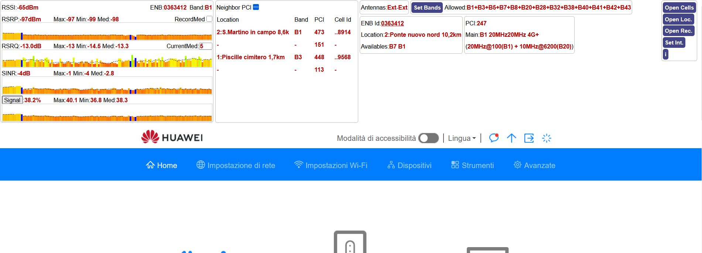
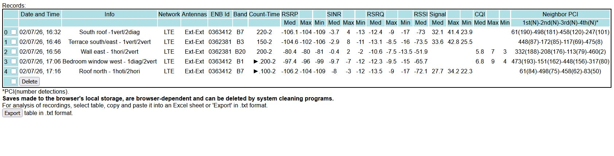

# Huawei router Hack

---

## English

### What is Huawei router hack?
- Huawei Router Hack is a JavaScript code that monitors and records the main radio parameters of the LTE (4G) and NR (5G) networks received by the modem, to improve reception and therefore performance.
- With Huawei Router Hack, you can find the best channels (or bands) available and the best position for the modem or external antennas.

### Installation and startup
1. Create/add a new Browser Favorites/Bookmarks and name it Hack.
2. Select all the JavaScript code from the 'Huawei router Hack.js' or 'README.md' file, copy and paste it into the Bookmark URL box, and save it.
3. Open the router's local URL from your browser (ex. 'http://192.168.8.1') and log in.
4. From the router page opened in the browser, load Hack from Bookmarks.

### Info
- Tested with **Huawei B818 and B636 4G router**, Firefox, Edge, Chrome browsers. 
- Base code v5.0 by miononno.it - Advanced **v1.4** by Riccardo Fanelli.

---

## Italiano

### Cos'è Huawei router hack?
- Huawei router Hack è uno codice JavaScript che monitora e registra i principali parametri radio delle reti LTE(4G) e NR(5G) captate dal modem, per migliorare la ricezione e quindi le prestazioni.
- Con Huawei router Hack puoi conoscere quali sono i migliori canali (o bande) disponibili e la miglior posizione del modem o delle antenne esterne.

### Installazione e avvio
1. Creare/aggiungere un nuovo Segnalibro/Preferito al Browser e nominarlo Hack.
2. Selezionare tutto il codice JavaScript del file 'Huawei router Hack.js' o "README.md', copiarlo e incollarlo nel riquadro URL del Segnalibro e salvarlo.
3. Dal browser aprire l'URL locale del router (es. http://192.168.8.1) e accedere.
4. Dalla pagina del router aperta nel browser, caricare Hack dai Segnalibri.

### Info
- Testato con **Huawei B818 e B636 4G**, browser Firefox, Edge, Chrome.
- Codice base v5.0 di miononno.it - Evoluzione **v1.4** di Riccardo Fanelli.

---





```javascript
javascript:ftb();
function ha(i,h)
{
	try{document.getElementById(i).innerHTML=h}catch(m){}
}
function ro(n)
{
    return Math.round(n*10)/10;
}
function net(p)
{
    return p.slice(0,3)=="lte"?"lte":"nr";
}
function msg(m)
{
    console.log(m);
}
function tit(a)
{
    t=document.getElementById("tit").style;if(a){t.display="block";ha("tit",a)}else t.display="none";
}
function extractXML(t,d)
{
	try{return d.split("</"+t+">")[0].split("<"+t+">")[1]}catch(m){return m.message}
}
function typeBand(d,n)
{
	for(d1="",x=0;x<90;x++)tb=Math.pow(2,x),BigInt("0x"+d)&BigInt(tb)?d1+=n+String(x+1)+"+":"";return d1.replace(/\++$/,"");
}
function loadbts()
{
    if(localStorage.getItem(stoname["bts"])===null)localStorage.setItem(stoname["bts"],JSON.stringify({}));    
    bts=JSON.parse(localStorage.getItem(stoname["bts"]));
    for(const[i,r]of Object.entries(bts_location))
        if(!(i in bts))bts[i]=[r[0],r[1]];else msg("Double BTS location in memory, ENB Id:"+i);
}
function loadcel()
{
    if(localStorage.getItem(stoname["cel"])===null)localStorage.setItem(stoname["cel"],JSON.stringify({}));    
    cel=JSON.parse(localStorage.getItem(stoname["cel"]));
}
function stopTimeout(t)
{
    xh=new XMLHttpRequest;xh.open("GET","/html/home.html",!0);xh.setRequestHeader("Content-type","application/json; charset=UTF-8"),xh.send(),xh.onload=function()
    {
        if(200===xh.status)
        {
            d=xh.responseText.split('name="csrf_token" content="');token=d[d.length-1].split('"')[0];
            xa=new XMLHttpRequest;xa.open("POST","/api/webserver/accessibility",!0);xa.setRequestHeader("Content-type","application/x-www-form-urlencoded; charset=UTF-8");xa.setRequestHeader("__RequestVerificationToken",token);xa.send('<?xml version="1.0" encoding="UTF-8"?><request><timeout>'+t+'</timeout></request>');
        }
    }
}
function start()
{
    let x=new XMLHttpRequest;x.open("GET","/api/device/signal",!0),x.setRequestHeader("Content-type","application/json; charset=UTF-8"),x.send(),x.onload=function()
    {
        if(200===x.status)
        {
            signval["plmn"]=extractXML("plmn",x.responseText);/*get&set plmn&link*/
            state=signval["plmn"].slice(0,3);
            if(state=="222")
            {
                if("22201"==signval["plmn"])signval["plmn"]="2221";
                if("22299"==signval["plmn"])signval["plmn"]="22288";
                link="https://lteitaly.it/internal/map.php%23bts="+signval["plmn"]+".";
            }
            else
                document.getElementById("enodeb_id").setAttribute("href","https://www.cellmapper.net");
            /*defined lte/nr/nrrssi/enodeb_id*/
            defined["nr"]="undefined"!=typeof extractXML("nrrsrp",x.responseText),defined["lte"]="undefined"!=typeof extractXML("rsrp",x.responseText),defined["nrrssi"]="undefined"!=typeof extractXML("nrrssi",x.responseText),defined["enodeb_id"]="undefined"!=typeof extractXML("enodeb_id",x.responseText);
            ["lte","nr"].forEach(function(b){if(defined[b])defltenr.push(b)});
            document.getElementsByName("nr").forEach(e=>{e.style.display=defined["nr"]?"block":"none"});/*set HTMLpage*/
            document.getElementsByName("lte").forEach(e=>{e.style.display=defined["lte"]?"inline-block":"none"});
            document.getElementsByName("net").forEach(e=>{e.style.display=defined["nr"]&&defined["lte"]?"inline-block":"none"});
        }
        else
            msg("Err Signal:"+x.status);
    };
    boxcar=parseInt(gw/gt),gtm=parseInt(gt/2);
    loadbts();
    loadcel();
    /*stop(restart)timeout(if available)=interval of<request>*/
    let xa=new XMLHttpRequest;xa.open("GET","/api/webserver/accessibility",!0),xa.setRequestHeader("Content-type","application/json; charset=UTF-8"),xa.send(),xa.onload=function()
    {
        if(200===xa.status&&xa.responseText.includes("response"))
        {
            t=extractXML("timeout",xa.responseText);
            stopTimeout(t);setInterval(stopTimeout,60000*(t-.5),t);
        }
    }
}
function currentData()
{
	if(suspend)return;
    try{document.getElementById("dhcp_mask").style.display="block",document.getElementById("dhcp_dns").style.display="block"}catch(e){}
/*  HUAWEI VARIABLES & FUNCTION
    start()             Huawei->(indipendent)signal->plmn,nrrsrp,rsrp,nrrssi,enodeb_id,accessibility->timeout
    clicksetLTEBand()   Huawei->(indipendent)*/
    Promise.all([
        getSignal(),    /*Huawei->(get&view parameter)signal->nrrsrp,nrrsrq,nrsinr,(nrrssi),(nrcqi0),(lte)rsrp,(lte)rsrq,(lte)sinr,(lte)rssi,(lte)cqi0,
                        nrdlbandwidth,nrulbandwidth,(lte)dlbandwidth,(lte)ulbandwidth,nrearfcn,(lte)earfcn,scc_pci,pci,band,enodeb_id,cell_id,nei_cellid->..*/
        getStatus(),    /*Huawei->(LTE band aggregation status)status->CurrentNetworkTypeEx->is4gp->..*/
        getAntenna(),   /*Huawei->(antennas status)antenna_type->antenna1type+antenna2type->..*/
        getNetmode(),   /*Huawei->(allowed bands status,indipendent)net-mode->LTEBand,NRBand*/
    ]).then(function()
    {         
        setENBMainBTS();/*..<-band,nrearfcn,(lte)earfcn,enodeb_id,cell_id<-Huawei*/
        Cells();        /*..<-pci,enodeb_id,cell_id,(lte)dlbandwidth<-Huawei*/ 
        neighborCell(); /*..<-nei_cellid<-Huawei*/  
        medControl();   /*..<-enodeb_id<-Huawei*/
        medCalc();
        barGraph();
        titleBar();     /*..<-enodeb_id<-Huawei,..<-is4gp<-CurrentNetworkTypeEx<-Huawei*/
    },function(e)
    {
        msg(e);
    });
/*  clickStorage()      ..<-enodeb_id<-Huawei
    clickRecMed()       ..<-antenna1type,antenna2type,enodeb_id<-Huawei
    extractXML()        (sub for Huawei function)
    4GType()            (sub for Huawei function)*/
}
function getSignal()
{
    return new Promise((resolve,reject)=>
    {
        let x=new XMLHttpRequest;x.open("GET","/api/device/signal",!0),x.setRequestHeader("Content-type","application/json; charset=UTF-8"),x.send(),x.onload=function()
        {
            if(200===x.status)
            {
                signal=d=x.responseText;
                signnam.forEach(function(b){signval[b]=extractXML(b.replace("lte",""),d);ha(b,signval[b])});/*get&view*/
                signnam2.forEach(function(b){signval[b]=extractXML(b.replace("lte",""),d)});/*get*/
                if(defined["nr"]&&!defined["nrrssi"]){ha("nrrssi","");signval["nrrssi"]="0"}
                for(i=defined["nr"]?0:8,l=defined["lte"]?13:5;i<l;i++)/*convert str->num||num-error*/
                {
                    if(i==5)i=8;currval[signnam[i]]=parseFloat(signval[signnam[i]].replace(/[^0-9\.\-]/g,"")||-999)+(signval[signnam[i]].includes("gt")?1:signval[signnam[i]].includes("lt")?-1:0);
                    if(currval[signnam[i]]>999||currval[signnam[i]]<-999)currval[signnam[i]]=-999;
                    if(signval[signnam[i]].includes("&")||(currval[signnam[i]]==-999&&!signnam[i].includes("cqi0")))msg(signnam[i]+":"+signval[signnam[i]]);
                }
                defltenr.forEach(function(b)/*calc&view sign lte&nr*/
                {
                    currval[b+"sign"]=Math.round(((currval[b+"rsrp"]-min_rsrp)/(max_rsrp-min_rsrp)*balance_rsrp+(currval[b+"rsrq"]-min_rsrq)/(max_rsrq-min_rsrq)*balance_rsrq+(currval[b+"sinr"]-min_sinr)/(max_sinr-min_sinr)*balance_sinr+(currval[b+"rssi"]-min_rssi)/(max_rssi-min_rssi)*balance_rssi)*10)/10,signval[b+"sign"]=currval[b+"sign"]+"%",ha(b+"sign",signval[b+"sign"]);
                });
                currnei=[];if(signval["nei_cellid"])signval["nei_cellid"].match(/(?<=:)\d+/g).forEach(function(v,i){currnei[i]=v});/*list nei_cellid*/
                resolve();
            }
            else
                reject("Err Signal:"+x.status);
        };
    });
}
function getStatus()
{
    return new Promise((resolve,reject)=>
    {/*get&view*/
        let x=new XMLHttpRequest;x.open("GET","/api/monitoring/status",!0),x.setRequestHeader("Content-type","application/json; charset=UTF-8"),x.send(),x.onload=function(){if(200===x.status)is4gp=1011==extractXML("CurrentNetworkTypeEx",status=x.responseText),ha("mode",is4gp?"4G+":"-"),resolve();else reject("Err Status:"+x.status)}
    });
}
function getAntenna()
{
    return new Promise((resolve,reject)=>
    {/*get&view*/
        let x=new XMLHttpRequest;x.open("GET","/api/device/antenna_type",!0),x.setRequestHeader("Content-type","application/json; charset=UTF-8"),x.send(),x.onload=function(){if(200===x.status)d=antennatype=x.responseText,antenna1type=extractXML("antenna1type",d)=="1"?"Ext":"Int",antenna2type=extractXML("antenna2type",d)=="1"?"Ext":"Int",ha("a1",antenna2type),ha("a2",antenna2type),resolve();else reject("Err Antenna:"+x.status)}
    });
}
function getNetmode()
{
    return new Promise((resolve,reject)=>
    {/*get&view*/
        let x=new XMLHttpRequest;x.open("GET","/api/net/net-mode",!0),x.setRequestHeader("Content-type","application/json; charset=UTF-8"),x.send(),x.onload=function()
        {
            if(200===x.status)
            {
                netmode=x.responseText;
                if(defined["lte"])ha("lteallowed",typeBand(extractXML("LTEBand",netmode),"B"));
                if(defined["nr"])ha("nrallowed",typeBand(extractXML("NRBand",netmode),"N"));
                resolve();
            }
            else 
                reject("Err Netmode:"+x.status)}
    });
}
function setENBMainBTS()
{
    if(!defined["enodeb_id"])/*set&view ENB&link*/
        mp=signval["cell_id"].indexOf("-"),mp>0?signval["enodeb_id"]=Number(signval["cell_id"].substr(0,mp)):(hex=Number(signval["cell_id"]).toString(16),hex2=hex.substring(0,hex.length-2),signval["enodeb_id"]=parseInt(hex2,16).toString().padStart(7,"0"));
    ha("enodeb_id",signval["enodeb_id"]);if(state==222)document.getElementById("enodeb_id").setAttribute("href",link+signval["enodeb_id"].replace(/^0+/,""));
    ba=signval["band"];/*set&view mainband&EARFCN*/
    defltenr.forEach(function(b)
    {
        bb=b=="lte"?"B":"N";signval[b+"main"]="";
        if(signval[b+"earfcn"])/*EARFCN=LTE&NR download&upload->"<..earfcn>DL:.. UL:..</..earfcn>"*/
            {s=signval[b+"earfcn"].split(" ");signval[b+"earfcndl"]=s[0].substr(3);signval[b+"earfcnul"]=s[1].substr(3)}
        else
            {signval[b+"earfcndl"]="";signval[b+"earfcnul"]=""}
        if(b=="lte"&&!isNaN(ba))signval[b+"main"]=bb+ba;/*band=LTE->"<band>3</band>"*/
        if(!signval[b+"main"]&&ba.includes("("))/*band=LTE&NR->1st->B&N->"<band>..@3100(B7)..@636666(N78)..</band>"*/
            for(const a of ba.match(/(?:\()[^\(\)]*?(?:\))/g))
                if((a.includes(bb))&&(/\d/).test(a))
                    {signval[b+"main"]=bb+a.replace(/[^0-9]/g,"");break}
        if(!signval[b+"main"])/*band=LTE&NR->EARFCN LTE&NR download&upload"*/
            for(const[k,n] of Object.entries(earfcn["eur"][b]))
                if("undefined"!=typeof n)
                    if(signval[b+"earfcndl"]>=n[0]&&signval[b+"earfcndl"]<=n[1]&&signval[b+"earfcnul"]>=n[2]&&signval[b+"earfcnul"]<=n[3])
                        {signval[b+"main"]=bb+k;break}
        ha(b+"main",signval[b+"main"]);
        if(!recstatus[b]){ha(b+"band",signval[b+"main"]);ha(b+"enb",signval["enodeb_id"])}/*view enb&main*/
        enbmainchange[b]=enbmainold[b]!=signval["enodeb_id"]+signval[b+"main"];enbmainold[b]=signval["enodeb_id"]+signval[b+"main"];/*set enb+main continuity(cell_id only lte)*/
    });
    b=document.getElementById("btsb").style;/*view BTSloc*/
	if(signval["enodeb_id"] in bts)
	{
        b.display="block";
		ha("namebts",bts[signval["enodeb_id"]][0]);
        ha("bandsbts",bts[signval["enodeb_id"]][1]);
	}
    else
    {
        ha("namebts","<button class='but' onclick='clickStorage(\"bts\",true)'>Add Location</button>");
        b.display="none";
    }
}
function Cells()/*only LTE,NR not cell_id*/
{
    defltenr.forEach(function(b)
    {
        if(enbmainchange[b])celchange[b]=true;/*auto save at 2nd interval*/
        else if(celchange[b]&&!enbmainchange[b])
        {
            celchange[b]=false;
            if(b=="lte"){p="";c=signval["cell_id"]}else{p="scc_";c=signval["enodeb_id"]+"-"+signval[p+"pci"].slice(2)}/*NR=scc_pci&not cell_id*/
            if(c&&c!="0"&&signval[b+"main"].slice(1)&&signval[b+"main"].slice(1)!="0")
            {
                d=new Date();t=d.toLocaleString(navigator.language,{dateStyle: 'short'});
                if(c in cel)
                {
                    a="";if(cel[c][0]!=signval[p+"pci"])a="1";if(cel[c][1]!=signval[b+"main"])a+="2";if(cel[c][2]!=signval[b+"dlbandwidth"])a+="3";if(cel[c][3]!=signval[b+"earfcndl"])a+="4";if(cel[c][4]!=signval["enodeb_id"])a+="5";
                    if(a)/*change*/
                        cel[c]=[signval[p+"pci"],signval[b+"main"],signval[b+"dlbandwidth"],signval[b+"earfcndl"],signval["enodeb_id"],"C"+a+"-"+t,t];
                    else/*last*/
                        cel[c][6]=t;
                    localStorage.setItem(stoname["cel"],JSON.stringify(cel));
                }
                if(!(c in cel))/*add*/
                {
                    cel[c]=[signval[p+"pci"],signval[b+"main"],signval[b+"dlbandwidth"],signval[b+"earfcndl"],signval["enodeb_id"],"A-"+t,t];
                    localStorage.setItem(stoname["cel"],JSON.stringify(cel));
                }
            }
        }
    });
}
function neighborCell()
{
    if(!neistatus)/*view*/
        return;
    tb=document.getElementById('neitab');
    if(signval["nei_cellid"])
    {
        h="";tb.style.opacity=1;
        currnei.forEach(function(v)
        {
            b0="-",b1="-",b2=v;b3="-";
            for(const[a]of Object.entries(cel))
                if(cel[a][0]==v)
                {
                    if(b0=="-"){b0=cel[a][4];b1=cel[a][1];b3=".."+a.slice(-4)}
                    else{b0="*";b1="*";b2=v+"*";b3="*"}/*double*/
                }
            if(neistatus==1)
                h+="<tr><td>"+b0+"</td><td>"+b1+"</td><td>"+b2+"</td></tr>";
            else if(recstatus["nr"]>=1||recstatus["lte"]>=1)
                h+="<tr><td>"+b0+"<span name='recnei'style='position:absolute;left:5em'></span></td><td>"+b1+"</td><td>"+b2+"</td><td>"+b3+"</td></tr>";
            else
                h+="<tr><td>"+(b0 in bts?bts[b0][0].substring(0,25).replace(/[^a-zA-Z]+$/,""):b0)+"</td><td>"+b1+"</td><td>"+b2+"</td><td>"+b3+"</td></tr>";
        });
        tb.innerHTML=h;
    }
    else if(tb.style.opacity>0)tb.style.opacity-=.35;
}
function medControl()
{
    recvalnot["nr"]=recvalnot["lte"]=false;
    for(const[p]of Object.entries(currval))
    {
        b=net(p);
        if(defined[b])
        {
/*rec*/     if(currval[p]==-999&&p!=notselsign[b])recvalnot[b]=true;
/*cur*/     if(!p.includes("rssi"))if(curmed[p].unshift(currval[p]+(currval[p]==-999?"|b":enbmainchange[b]?"|a":"|"))>boxcar*2)curmed[p].pop();
        }
    }
    defltenr.forEach(function(b)
    {
/*rec*/ if(recstatus[b]==1||recstatus[b]==2)
        {
            if(reccount[b]>=recmaxcount[b])
            { 
                c=document.getElementById("rec"+b);c.checked=false;clickRecMed(c,b);
            }
            else if(signval["enodeb_id"]!=recenb[b]||signval[b+"main"]!=recband[b]||recvalnot[b])
            {
                recstatus[b]=2;
                recpause[b]="►.";
                if(signval["enodeb_id"]!=recenb[b])recenbpause[b]="►.";
                if(signval[b+"main"]!=recband[b])recbandpause[b]="►.";
                ha(b+"enb",recenb[b]+recenbpause[b]);
                ha(b+"band",recband[b]+recbandpause[b]);
                ha("medcount"+b,reccount[b]+"../");
            }
            else
            {
                recstatus[b]=1;reccount[b]++;
                ha("medcount"+b,reccount[b]+recpause[b]+"/");
            }
        }
/*cur*/ else if(!recstatus[b])
        {
            if(!curmaxcount[b])
            {
                if(curstatus[b]==1)curstatus[b]=2;
                ha("medcount"+b,"");
            }
            else
            {
                for(i=0,l=Math.min(curmaxcount[b],curmed[b+"rsrp"].length);i<l&&!curmed[b+"rsrp"][i].split("|")[1];i++);
                if(i<curmaxcount[b]-1)
                {
                    curstatus[b]=2;
                    ha("medcount"+b,i+1-curmaxcount[b]+"/")
                }
                else
                {
                    curstatus[b]=1;
                    ha("medcount"+b,"")
                }
            }
            if(curstatus[b]==2){curstatus[b]=0;ha("med"+b+"rsrp","");ha("med"+b+"rsrq","");ha("med"+b+"sinr","");ha("med"+selsign[b],"")}
        }
    });
}
function medCalc()
{
    for(const[p]of Object.entries(currval)) 
    {
        b=net(p);
        if(defined[b])
/*rec*/     if(recstatus[b]==1)
            {
                recmed[p]=(recmed[p]*(reccount[b]-1)+currval[p])/reccount[b];
                if(!p.includes("rssi"))
                {
                    if(currval[p]>recmax[p])recmax[p]=currval[p];if(currval[p]<recmin[p])recmin[p]=currval[p];
                    if(p!=notselsign[b])ha("med"+p,"Max:<span class='val'>"+recmax[p]+"</span> Min:<span class='val'>"+recmin[p]+"</span> Med:<span class='val'>"+ro(recmed[p])+"</span>");
                }
                else if(b=="lte"||(b=="nr"&&defined["nrrssi"]))
                    ha("med"+p,"Med:<span class='val'>"+ro(recmed[p])+"</span>");
            }
/*curr*/    else if(!recstatus[b]&&curstatus[b]==1&&!p.includes("rssi"))
            {
                for (ma=-999,mi=999,me=0,i=0;i<curmaxcount[b];i++)
                {
                    if(curmed[p][i].split("|")[1]=="b"){ma="";mi="";me="";break}
                    a=parseFloat(curmed[p][i].split("|")[0]);
                    if(a>ma)ma=a;if(a<mi)mi=a;me+=a;
                }
                curmedsign[b]=me?ro(me/i):"";
                if(p!=notselsign[b])ha("med"+p,"Max:<span class='val'>"+ma+"</span> Min:<span class='val'>"+mi+"</span> Med:<span class='val'>"+curmedsign[b]+"</span>");
            }
    }
    currnei.forEach(function(v,k)/*recnei*/
    {
        c="";
        defltenr.forEach(function(b)
        {
            if(recstatus[b]==1)
            {
                recnumnei[b][v]=(v in recnumnei[b])?recnumnei[b][v]+1:1;
                c+=(c?"&ensp;":"")+recnumnei[b][v];
            }
        });
        if(c&&neistatus==2)document.getElementsByName("recnei")[k].innerHTML=c;
    });
}
function barGraph()
{
    for(const[p,vv]of Object.entries(currval))
    {
        b=net(p);
        if(p!="nrrssi"&&p!="lterssi"&&defined[b])
        {
            bb=p.slice(b.length),min=window["min_"+bb],max=window["max_"+bb];
/*current*/ v=vv;abc=(enbmainchange[b]?"|a":"|")+(signval[p].includes("lt")||v<min?"|b":signval[p].includes("gt")||v>max?"|c":"|");if(v<min)v=min;if(v>max)v=max;
            if(currgra[p].unshift(v+abc)>boxcar)currgra[p].pop();
/*recmed*/  if(recstatus[b])if(recmedgra[p].unshift(recstatus[b]==1?true:false).length>boxcar)recmedgra[p].pop();
/*graph*/   if(p!=notselsign[b])
            {
                for(h="",l=currgra[p].length,x=0;x<l;x++)
                {
                    px=2+gt*x;
/*current*/         a=currgra[p][x].split("|"),c=(a[0]-min)/(max-min);
                    d=c*100,co=a[1]=="a"?"blue":a[2]=="b"?"":a[2]=="c"?"green":"rgb("+5*Math.round(d<50?50:100-d)+" "+5*Math.round(d>50?50:d)+" 0)";
                    h+='<line x1="'+px+'"y1="'+gh+'"x2="'+px+'"y2="'+(gh-c*gh-1)+'"stroke="'+co+'"stroke-width="'+gt+'"/>';
/*curmed*/          if(!recstatus[b]&&curmaxcount[b])
                    {
                        for(me=0,i=x,ll=Math.min(x+curmaxcount[b],curmed[p].length);i<ll&&!curmed[p][i].split("|")[1];i++)
                        {
                            if(curmed[p][Math.min(i+1,curmed[p].length)].split("|")[1]=="b")break;
                            me+=parseFloat(curmed[p][i].split("|")[0]);
                        }
                        if(i>=x+curmaxcount[b]-1)
                        {
                            me=me/(i-x);if(me>max)me=max;if(me<min)me=min;
                            py=gh-(me-min)/(max-min)*gh;
                            h+='<line x1="'+px+'"y1="'+(py-1)+'"x2="'+px+'"y2="'+py+'"stroke="black"stroke-width="'+gtm+'"/>';
                        }
                    }
/*recmed*/          if(recmedgra[p][x])
                    {
                        me=recmed[p];if(me>max)me=max;if(me<min)me=min;
                        py=gh-(me-min)/(max-min)*gh;
                        h+='<line x1="'+px+'"y1="'+(py-1)+'"x2="'+px+'"y2="'+py+'"stroke="black"stroke-width="'+gtm+'"/>';
                    }
                }
                document.getElementById("b"+p).innerHTML='<svg version="1.1"viewBox="0 0 '+gw+' '+gh+'"width="'+gw+'"height="'+gh+'"preserveAspectRatio="xMaxYMax slice"style="border:1px solid %23ccc;padding:1px;margin:-6px 0 -10px;width:'+gw+'px">'+h+'</svg>';
            }
        }
    }
}
function titleBar()
{
    let t=!isNaN(signval["enodeb_id"])?(signval["enodeb_id"] in bts?bts[signval["enodeb_id"]][0].substring(0,16).replace(/[^a-zA-Z]+$/,""):signval["enodeb_id"]):"";
    t+="|"+signval["ltemain"].slice(1)+(is4gp?"+":"")+(defined["nr"]?" "+signval["nrmain"].slice(1):"")+"|";
    defltenr.forEach(function(b)
    {
        if(recstatus[b]>0)
            t+=reccount[b]+((signval["enodeb_id"]!=recenb[b]||signval[b+"main"]!=recband[b]||recvalnot[b])?"..":recpause[b])+" ";
        else if(curstatus[b]==1)
            t+=curmedsign[b].toFixed(0)+"%";
        else
            t+=currval[b+"sign"].toFixed(0)+"%";
    });
    document.title=t;
}
function clickRecMed(a,b)
{
	if(a.readOnly)a.checked=a.readOnly=false;else if(!a.checked)a.readOnly=a.indeterminate=true;
    c=document.getElementById("count"+b),ss=document.getElementById("selsign"+b),msc=document.getElementById("medsetcount"+b);
	if(a.checked)
	{
        recstatus[b]=1;
		recenb[b]=signval["enodeb_id"],recband[b]=signval[b+"main"],ha(b+"enb",recenb[b]+"►"),ha(b+"band",recband[b]+"►");
        c.firstChild.data="Count:",msc.value=recmaxcount[b],msc.setAttribute("onblur","clickNumRecMed(this,'"+b+"')"),ss.disabled=true;
        if(neistatus==2)ha("neitaps","<tr><td>ENB Id&emsp;&ensp;RecNum PCI</td><td>Band</td><td>PCI</td><td>Cell Id</td></tr>");
	}
	else if(a.indeterminate)
    {
        recstatus[b]=3;
        ha("medcount"+b,reccount[b]+"■/"),ha("store"+b,"<button class='but2' onclick='clickStorage(\"rec\",\""+b+"\")'>Save Rec.</button>");
        recant=antenna1type+"-"+antenna2type;
        for(r=[["","","",""],[0,0,0,0]],i=0;i<4;i++)for(const[k,v]of Object.entries(recnumnei[b]))if(!r[0].includes(k)&&v>r[1][i]){r[0][i]=k;r[1][i]=v}
        for(recneires[b]="",i=0;i<4;i++)if(r[0][i])recneires[b]+=r[0][i]+"("+r[1][i]+") ";recneires[b]=recneires[b].slice(0,-1);
        if(neistatus==2)ha("neirec"+b,"RecNum "+(b=="nr"?""/*"NR "*/:"")+"PCI:<span class='val'>"+recneires[b]+"</span>");
    }
	else
	{
        recstatus[b]=0;
        reccount[b]=0,recpause[b]="",recenbpause[b]=recbandpause[b]="►",recmaxcount[b]=999;
        for(const[p]of Object.entries(currval))if(net(p)==b){if(!p.includes("rssi")){recmax[p]=-999,recmin[p]=999,recmedgra[p].length=0}recmed[p]=0}
        Object.keys(recnumnei[b]).forEach(i=>delete recnumnei[b][i]);
        ha("med"+b+"rsrp",""),ha("med"+b+"rsrq",""),ha("med"+b+"sinr",""),ha("med"+b+"rssi",""),ha("med"+selsign[b],"");
        c.firstChild.data="CurrentMed:",ha("medcount"+b,""),msc.value=curmaxcount[b]?curmaxcount[b]:"",msc.setAttribute("onblur","clickNumCurMed(this,'"+b+"')"),ha("store"+b,""),ss.disabled=false;
        if(neistatus==2&&!recstatus["nr"]&&!recstatus["lte"])ha("neitaps","<tr><td>Location</td><td>Band</td><td>PCI</td><td>Cell Id</td></tr>");
        ha("neirec"+b,"")
	}
}
function clickNei(a)
{
    if(a.readOnly)a.checked=a.readOnly=false;else if(!a.checked)a.readOnly=a.indeterminate=true;
    n=document.getElementById('nei').style,s=document.documentElement.style;
    ha('neitab',"");
    function td(c,d,e,f)
    {
        s.setProperty("--neitd1",c+"%"),s.setProperty("--neitd2",d+"%"),s.setProperty("--neitd3",e+"%"),s.setProperty("--neitd4",f+"%");
    }
    if(a.checked)
	{
        neistatus=1,ee=defined["lte"]?document.getElementsByName("lte")[0]:document.getElementsByName("nr")[0],n.height=ee.clientHeight-2*parseInt(getComputedStyle(ee).padding)+"px";
        td(44,28,28,0),ha("neitaps","<tr><td>ENB Id</td><td>Band</td><td>PCI</td></tr>");
    }
    else if(a.indeterminate)
    {
        neistatus=2,n.width="24em";
        td(56,14,14,16),ha("neitaps","<tr><td>"+(recstatus["nr"]||recstatus["lte"]?"ENB Id&emsp;&ensp;RecNum PCI":"Location")+"</td><td>Band</td><td>PCI</td><td>Cell Id</td></tr>");
        defltenr.forEach(function(b){if(recstatus[b]==3)ha("neirec"+b,"RecNum "+(b=="nr"?"NR ":"")+"PCI:<span class='val'>"+recneires[b]+"</span>")});
    }
    else
    {
        neistatus=0,n.width="12em",n.height="2em";
        td(0,0,0,0),ha("neitaps","");
        ha("neireclte",""),ha("neirecnr","");
    }
}
function clicksetLTEBand(bs)
{
    var band;if(mainband&&(mainband=null),0==arguments.length){if((band=prompt("Please input LTE bands number allowed separated by '+', add 'm' to set main (example '1+3+20' or 'm3+7', the main setting is cyclically reworked by the modem). For use every supported bands, write 'AUTO'.","AUTO"))&&(band=band.toLowerCase()),null==band||""===band)return}else var band=arguments[0];var bs=band.split("+"),ltesum=0;if("AUTO"===band.toUpperCase())ltesum="7FFFFFFFFFFFFFFF";else{for(var i=0;i<bs.length;i++){if(-1!=bs[i].toLowerCase().indexOf("m")&&(bs[i]=bs[i].replace("m",""),mainband=bs[i]),"AUTO"===bs[i].toUpperCase()){ltesum="7FFFFFFFFFFFFFFF";break}ltesum+=Math.pow(2,parseInt(bs[i])-1)}ltesum=ltesum.toString(16)}if(mainband)return _2ndrun=bs,void clicksetLTEBand(String(mainband));suspend=1,ha("t","! PLEASE WAIT !"),tit("! PLEASE WAIT !"),xhrh=new XMLHttpRequest,xhrh.open("GET","/html/home.html",!0),xhrh.setRequestHeader("Content-type","application/json; charset=UTF-8"),xhrh.send(),xhrh.onload=function(){if(200===xhrh.status){var datas=xhrh.responseText.split('name="csrf_token" content="'),token=datas[datas.length-1].split('"')[0],nw="00";document.getElementById("force4g").checked&&(nw="03"),console.log(nw),setTimeout((function(){xhrp=new XMLHttpRequest,xhrp.open("POST","/api/net/net-mode",!0),xhrp.setRequestHeader("Content-type","application/json; charset=UTF-8"),xhrp.setRequestHeader("__RequestVerificationToken",token),cmd='<?xml version="1.0" encoding="UTF-8"?><request><NetworkMode>'+nw+"</NetworkMode><NetworkBand>3FFFFFFFFFFFFFFF</NetworkBand><LTEBand>"+ltesum+"</LTEBand>"+(defined["nr"]?"<NRBand>"+extractXML("NRBand",netmode)+"</NRBand>":"")+"</request>",xhrp.send(cmd),xhrp.onload=function(){200===xhrp.status?(ha("band",'<span style="color:green;">OK</span>'),_2ndrun?window.setTimeout((function(){clicksetLTEBand(_2ndrun.join("+")),_2ndrun=!1}),2e3):(suspend=0,tit())):msg("Err net-mode:"+x.status);}}),2e3)}}
}
function clicksetNRBand(bs)
{
    var band;if(mainband&&(mainband=null),0==arguments.length){if((band=prompt("Please input NR bands number allowed separated by '+', add 'm' to set main (example '1+78' or 'm38+78', the main setting is cyclically reworked by the modem). For use every supported bands, write 'AUTO'.","AUTO"))&&(band=band.toLowerCase()),null==band||""===band)return}else var band=arguments[0];var bs=band.split("+"),nrsum=0;if("AUTO"===band.toUpperCase())nrsum="4000000000000000006";else{for(var i=0;i<bs.length;i++){if(-1!=bs[i].toLowerCase().indexOf("m")&&(bs[i]=bs[i].replace("m",""),mainband=bs[i]),"AUTO"===bs[i].toUpperCase()){nrsum="4000000000000000006";break}nrsum+=Math.pow(2,parseInt(bs[i])-1)}nrsum=nrsum.toString(16)}if(mainband)return _2ndrun=bs,void clicksetNRBand(String(mainband));suspend=1,ha("t","! PLEASE WAIT !"),tit("! PLEASE WAIT !"),xhrh=new XMLHttpRequest,xhrh.open("GET","/html/home.html",!0),xhrh.setRequestHeader("Content-type","application/json; charset=UTF-8"),xhrh.send(),xhrh.onload=function(){if(200===xhrh.status){var datas=xhrh.responseText.split('name="csrf_token" content="'),token=datas[datas.length-1].split('"')[0],nw="00";document.getElementById("force4g").checked&&(nw="03"),console.log(nw),setTimeout((function(){xhrp=new XMLHttpRequest,xhrp.open("POST","/api/net/net-mode",!0),xhrp.setRequestHeader("Content-type","application/json; charset=UTF-8"),xhrp.setRequestHeader("__RequestVerificationToken",token),cmd='<?xml version="1.0" encoding="UTF-8"?><request><NetworkMode>'+nw+"</NetworkMode><NetworkBand>3FFFFFFFFFFFFFFF</NetworkBand>"+(defined["lte"]?"<LTEBand>"+extractXML("LTEBand",netmode)+"</LTEBand>":"")+"<NRBand>"+NRsum+"</NRBand></request>",xhrp.send(cmd),xhrp.onload=function(){200===xhrp.status?(ha("band",'<span style="color:green;">OK</span>'),_2ndrun?window.setTimeout((function(){clicksetNRBand(_2ndrun.join("+")),_2ndrun=!1}),2e3):(suspend=0,tit())):msg("Err net-mode:"+x.status);}}),2e3)}}
}
function clickNumRecMed(a,b)
{
    recmaxcount[b]=parseInt(a.value=a.value?a.value:recmaxcount[b]);
}
function clickNumCurMed(a,b)
{
    curmaxcount[b]=parseInt(a.value=!a.value?"":a.value>boxcar?boxcar:a.value)||0;
}
function clickSelSign(a,b)
{
    document.getElementById(selsign[b]).setAttribute("id",a);
    document.getElementById("med"+selsign[b]).setAttribute("id","med"+a);
    document.getElementById("b"+selsign[b]).setAttribute("id","b"+a);
    notselsign[b]=selsign[b];selsign[b]=a;
}
function clickTime()
{
    do{t=prompt("Please input interval time (1 to 600 seconds)",itime/1000);if(t==null)return}while(t==""||t<1||t>600||isNaN(t))
    itime=parseFloat(ro(t))*1000;clearInterval(interval);interval=setInterval(currentData,itime);
}
function clickInfo()
{
    alert("--- Definitions ---\nRSSI: Total signal strength of the useful signal+interference from signals from other cells+noise from other sources.\n\nRSRP: Useful signal strength of the cell to which you are connected.\n\nRSRQ: Implicit signal quality from the RSRP/RSSI ratio, which indicates the prevalence of the useful signal over the others.\n\nSINR: Explicit signal quality evaluation from the ratio of the useful signal strength to interference+noise strengths.\n\nCQI / Signal: Conventional signal quality evaluation calculated by the modem and sent to the BTS which, by adjusting the signal modulation, balances data transmission speed and connection reliability. / Signal quality evaluation calculated by balancing the underlying parameters.\n\nBandwidth: bandwidth used to transmit a maximum amount of data in one second.\n\nEARFCN: Conventional and unique identification number used to identify the uplink or downlink frequency band (no real frequancy).\n\nCell Id / PCI: Identification number of a radio signal at a specific frequency or band transmitted and received by an antenna / Short id. num. of a cell in a limited area.\n\nBTS / ENB Id: Base tower station / Id. num. for 2nd advanced node for LTE of a BTS.");
    alert("--- Parameters ---\n--- SIGNAL QUALITY BALANCED (to change edit the Hack script)\nsignal_balance_rssi="+signal_balance_rssi+"%\nsignal_balance_rsrp="+signal_balance_rsrp+"%\nsignal_balance_rsrq="+signal_balance_rsrq+"%\nsignal_balance_sinr="+signal_balance_sinr+" % \n\n--- SIGNAL VALUE LIMITS (to change edit the Hack script)\nmax_rssi="+max_rssi+"dBm min_rssi="+min_rssi+"dBm\nmax_rsrp="+max_rsrp+"dBm min_rsrp="+min_rsrp+"dBm\nmax_rsrq="+max_rsrq+"dB min_rsrq="+min_rsrq+"dB\nmax_sinr="+max_sinr+"dB min_sinr="+min_sinr+"dB\n\n--- EARFCN (to add or change edit the Hack script)\n...(list)\n\n--- GEOGRAPHICAL AREA (to change edit the Hack script)\ngeo_area="+geo_area.toUpperCase()+"\n\n--- BTS LOCATIONS (to add edit the Hack script)\n...(list)\n\n--- Info ---\nSignal, band and cell parameters if not specified are LTE.\nThe Hack script processes the parameters made available by the router API.\nTested with Huawei B818 and B636 4G router, Firefox, Edge, Chrome browsers.");
}
function clickStorage(tipo,b)
{
    sn=stoname[tipo];
    if(tipo=="rec")
    {
        wwi=1700;savq=["Please input new record info (optional)."],savl=[35];
        h0="";h1="Records:",h2="For analysis of recordings, select table, copy and paste it into an Excel sheet or 'Export' in .txt format.";
        re1=[["","Date and Time","Info","Network","Antennas","ENB Id","Main","Count-Time","RSRP","","","SINR","","","RSRQ","","","RSSI","Signal","","","CQI","","","Neighbor PCI"],["","","","",(defined["nr"]&&defined["lte"]?"5G":""),"","","","Med","Max","Min","Med","Max","Min","Med","Max","Min","Med","Med","Max","Min","Med","Max","Min","1st(n) 2nd(n) 3rd(n) 4th(n)"]];
        re2=[];
        if(localStorage.getItem(sn)===null)localStorage.setItem(sn,JSON.stringify([]));re3=JSON.parse(localStorage.getItem(sn));
    }
    if(tipo=="bts")
    {
        wwi=900;savq=["Please input new BTS location name (optional).\nThe BTS location name and available bands can also be permanently inserted directly into the Hack script.\nTo get info about BTS locations, search for 'Enb Id' on the websites cellmapper.net or lteitaly.it.","Input availables BTS bands (optional)."],savl=[35,35];
        h0="* Douplicate.<br>";h1="Locations:",h2="To manually save locations, add it to the bottom of the Hack script (grey in table).";
        re1=[["ENB Id","BTS location name","Availables bands"]];
        re2=JSON.parse(JSON.stringify(bts_location));
        re3=JSON.parse(localStorage.getItem(sn));
        enb=signval["enodeb_id"];
    }
    if(tipo=="cel")
    {
        wwi=900;h0="* Douplicate. ** Changes: 1 PCI, 2 Band, 3 Bandwidth, 4 EARFCN, 5 ENB.<br>";h1="Cells:",h2="Saving and updating reference data for cells is automatic when connecting to it as the main band.<br>The values may be subject to change by the network operator and The 'PCI' number may be duplicated and not correctly identifiable in neighboring cells.<br>'Cell Id' for NR not available in modem API.<br>You can use 'PCI' and 'EARFCN download' parameters to set (if available) '192.168.8.1/->(Accessibility mode off)->Advanced->System->System Settings->Developer options->Band selection->...'.";
        re1=[["Cell Id","PCI","Band","Bandwidth dl","EARFCN dl","ENB Id","Location","Add/Change**","Last used"]];
        re2=[];
        re3=JSON.parse(localStorage.getItem(sn));re3s=JSON.parse(JSON.stringify(re3));
        for(const[a]of Object.entries(re3))
        {
            if(re3[a][4] in bts)re3[a].splice(5,0,bts[re3[a][4]][0]);
            else{re3[a].splice(5,0,"<button onclick='window.opener.clickStorage(\"bts\",true)'>Add Location</button>");re3[a][4]="<a target='_blank' href='"+link+re3[a][4].replace(/^0+/,"")+"'>"+re3[a][4]+"</a>"}
        }
        for(const[a]of Object.entries(re3))for(const[aa]of Object.entries(re3))if(re3[aa][0]==re3[a][0].replace("*","")&&a!=aa)re3[aa][0]+="*";
    }
    h3=tipo=="rec"?"":"<br>For info <a href='https://www.cellmapper.net'target='_blank'>cellmapper.net</a>, <a href='https://celltracker.it'target='_blank'>Celltracker.it</a>, <a href='https://sqimway.com/'target='_blank'>sqimway.com</a> or <a href='https://lteitaly.it'target='_blank'>lteitaly.it</a> (registration recommended).";
    function tab()
    {
        h="";
        for(const[a]of Object.entries(re1)){h+="<tr bgcolor='B0E0E6'>";for(const[,c]of Object.entries(re1[a]))h+="<td>"+c+"</td>";h+="</tr>"}
        for(const[a]of Object.entries(re2)){h+="<tr bgcolor='%23C0C0C0'><td>"+a+(a in re3?"*":"")+"</td>";for(const[,c]of Object.entries(re2[a]))h+='<td>'+c+'</td>';h+='</tr>'}
        for(const[a]of Object.entries(re3)){h+="<tr><td bgcolor='B0E0E6'>"+a+(a in re2?"*":"")+" <input type='checkbox'name='c'value='"+a+"'></td>";for(const[,c]of Object.entries(re3[a]))h+='<td>'+c+'</td>';h+='</tr>'}
        h+="<tr><td bgcolor='B0E0E6' style='text-align:right'><input id='cc'type='checkbox'onclick='c=document.getElementsByName(\"c\");for(i in c)c[i].checked=this.checked;'></td><td><button onclick='delsto()'>Delete</button></td></tr>";
        t=document.createElement('table'),t.innerHTML=h;tb=w.document.getElementById('tb'),tb.replaceChildren(t);
    };
    w=window.open("","Hack store","width="+wwi+",height=800");w.focus();w.document.body.innerHTML="";
    w.delsto=function()
    {
        for(c=w.document.getElementsByName('c'),i=c.length-1;i>=0;i--)
            if(c[i].checked)
            {
                delete re3[c[i].value];
                if(tipo=="rec"){localStorage.setItem(sn,JSON.stringify(re3.filter(n=>n!=null)))}
                if(tipo=="bts"){localStorage.setItem(sn,JSON.stringify(re3));loadbts()}
                if(tipo=="cel"){delete re3s[c[i].value];localStorage.setItem(sn,JSON.stringify(re3s));loadcel()}
            }
        w.document.getElementById("cc").checked=false;
        tab();
    };
    w.savtxt=function()
    {
        r="";re1.forEach(function(c){r+=c+"\n"});b=new Blob([(r+"\n- In script -\n"+JSON.stringify(re2)+"\n\n- In local storage -\n"+JSON.stringify(re3)).replaceAll("],","],\n")],{type:"text/plain"});
        l=document.createElement('a');l.href=URL.createObjectURL(b);l.download=sn+".txt";l.click();
    };
    w.document.write("<!DOCTYPE html><html><style>body{font-family:Arial;font-size:.9em}td{padding:2px}table{border:2px solid black}</style><body>"+h1+"<br><span id='tb'></span>"+h0+"<b>Saves made to the browser's local storage; they are browser-dependent and can be deleted by system cleaning programs.</b><br>"+h2+h3+"<br><button onclick='savtxt()'>Export</button> table in .txt format.</body></html>");
    tab();
    if(b)setTimeout(function()
    {
        for(var inf=[],l=savq.length,i=0;i<l;i++)do{inf[i]=w.prompt(savq[i]+"\nMax "+savl[i]+" char.");if(inf[i]===null)return}while(inf[i].length>savl[i]);
        if(tipo=="rec")
        {
            d=new Date();t=d.toLocaleString(navigator.language,{dateStyle: 'short',timeStyle: 'short'});
            if(selsign[b]==b+"cqi0"){rmes=rmis=rmas="";rmec=ro(recmed[b+"cqi0"]);rmic=recmin[b+"cqi0"];rmac=recmax[b+"cqi0"]}else{rmec=rmic=rmac="";rmes=ro(recmed[b+"sign"]);rmis=ro(recmin[b+"sign"]);rmas=ro(recmax[b+"sign"])}
            re3.push([t,inf[0],b.toUpperCase(),recant,recenb[b],recband[b],recpause[b]+reccount[b]+"-"+(itime/1000),ro(recmed[b+"rsrp"]),recmax[b+"rsrp"],recmin[b+"rsrp"],ro(recmed[b+"sinr"]),recmax[b+"sinr"],recmin[b+"sinr"],ro(recmed[b+"rsrq"]),recmax[b+"rsrq"],recmin[b+"rsrq"],ro(recmed[b+"rssi"]),rmes,rmas,rmis,rmec,rmac,rmic,recneires[b]]);
        }
        if(tipo=="bts")
        {
            bts[enb]=[inf[0],inf[1]];
            re3[enb]=[inf[0],inf[1]];
        }
        localStorage.setItem(sn,JSON.stringify(re3));
        tab();
    },99);
}
function ftb()
{
	document.body.insertAdjacentHTML("afterbegin",'
	<style>
    :root
    {
        --neitd1:0;
        --neitd2:0;
        --neitd3:0;
        --neitd4:0;
    }
    .val,.vali
	{
		color:%23b00;
		font-weight:bold;
	}  
    .vali
    {
        height:11px;
        width:28px;
        font-family:inherit;
        font-size:inherit;
    }
    .sel
    {
        height:20px;
        appearance:none;
        border-radius:2px;
        font-family:inherit;
        font-size:inherit;
    }
    %23nei
    {
        position:relative;
        width:12em;
        height:2em;
        overflow:hidden; 
    }
    .nei
    {
        width:100%;
        border-collapse:collapse;
        table-layout:fixed;
    }
    .nei td:nth-child(1) 
    {
        width:var(--neitd1);
    }
    .nei td:nth-child(2) 
    {
        width:var(--neitd2);
    }
    .nei td:nth-child(3) 
    {
        width:var(--neitd3);
    }
    .nei td:nth-child(4) 
    {
        width:var(--neitd4);
    }
    .f
    {
		border:1px solid %23bbb;
		border-radius:5px;
		padding:2px;
		line-height:2em;
		margin:2px;
        float:left;
        position:relative;
        display:inline;
    }
	%23tit
	{
		color:white;
		background-color:%23888;
		margin:2px;
		padding:2px;
		border-radius:5px;
		text-align:center;
		font-weight:bold;
	}
    .med
    {
        position:absolute;
        left:8em;
    }
    .but,.but2
    {
        font-weight:bold;
        background-color:%23448;
        border:none;
        color:white;
        padding:5px;
        border-radius:5px;
    }
    .but2
    {
        padding:2px 5px 2px 5px;
    }
	</style>
	<div style="display:block;overflow:auto;position:relative;font-size:14px"><div id="tit"></div>
    <div name="lte" class="f">
    RSSI:<span id="lterssi" class="val"></span><span id="medlterssi" class="med"></span><span style="float:right">ENB:<span id="lteenb" class="val"></span>&ensp;Band:<span id="lteband" class="val"></span></span><br>
    RSRP:<span id="ltersrp" class="val"></span><span id="medltersrp" class="med"></span><span style="float:right">RecordMed <input type="checkbox" id="reclte" onclick="clickRecMed(this,\'lte\');"></span><div id="bltersrp"></div>
    RSRQ:<span id="ltersrq" class="val"></span><span id="medltersrq" class="med"></span><span style="float:right" id="countlte">CurrentMed:<span id="medcountlte" class="val"></span><input id="medsetcountlte" class="vali" maxlength="4" onkeypress="return(event.charCode>=48&&event.charCode<=57);" onblur="clickNumCurMed(this,\'lte\')" onfocus="this.value=\'\';"></span><div id="bltersrq"></div>
    SINR:<span id="ltesinr" class="val"></span><span id="medltesinr" class="med"></span><span style="float:right;margin-top:-2px" id="storelte"></span><div id="bltesinr"></div>
    <select id="selsignlte" class="sel" onchange="clickSelSign(this.value,\'lte\')"><option value="ltesign">Signal</option><option value="ltecqi0">CQI</option></select>:<span id="ltesign" class="val"></span><span id="medltesign" class="med"></span><div id="bltesign"></div>
    </div>
    <div name="nr" class="f">
    NR RSSI:<span id="nrrssi" class="val"></span><span id="mednrrssi" class="med"></span><span style="float:right">ENB:<span id="nrenb" class="val"></span>&ensp;NR Band:<span id="nrband" class="val"></span></span><br>
	NR RSRP:<span id="nrrsrp" class="val"></span><span id="mednrrsrp" class="med"></span><span style="float:right">RecordMed <input type="checkbox" id="recnr" onclick="clickRecMed(this,\'nr\');"></span><div id="bnrrsrp"></div>
    NR RSRQ:<span id="nrrsrq" class="val"></span><span id="mednrrsrq" class="med"></span><span style="float:right" id="countnr">CurrentMed:<span id="medcountnr" class="val"></span><input id="medsetcountnr" class="vali" maxlength="4" onkeypress="return(event.charCode>=48&&event.charCode<=57);" onblur="clickNumCurMed(this,\'nr\')" onfocus="this.value=\'\';"></span><div id="bnrrsrq"></div>
    NR SINR:<span id="nrsinr" class="val"></span><span id="mednrsinr" class="med"><span style="float:right;margin-top:-2px" id="storenr"></span></span><div id="bnrsinr"></div>
    <select id="selsignnr" class="sel" onchange="clickSelSign(this.value,\'nr\')"><option value="nrsign">NR Signal</option><option value="nrcqi0">NR CQI</option></select>:<span id="nrsign" class="val"></span><span id="mednrsign" class="med"></span><div id="bnrsign"></div>
    </div>
    <div id="nei" class="f">
    Neighbor PCI <input type="checkbox" id="neifor" onclick="clickNei(this);">
    <table id="neitaps" class="nei"></table><table id="neitab" class="nei val"></table>
    <span style="position:absolute;bottom:0"><span id="neireclte"></span><br><span id="neirecnr"></span></span>
    </div>
    <div class="f">
	<span name="net">5G&nbsp;</span>Antennas:<span id="a1" class="val"></span>-<span id="a2" class="val"></span>
	</div>
<!-- </div><div style="display:block;overflow:auto;position:relative;font-size:14px"> -->
	<div class="f">
    <span name="net">Force set 4G <input type="checkbox" id="force4g"></span> <span name="lte"><button class="but" onclick="clicksetLTEBand()">Set Bands</button> Allowed:<span id="lteallowed" class="val"></span></span>
    <span name="nr"><button class="but" onclick="clicksetNRBand()">Set NR Bands</button>NR Allowed:<span id="nrallowed" class="val"></span></span>
	</div>
	<div class="f">
	ENB Id:<a id="enodeb_id" class="val" target="lteitaly" href="%23">%23</a><br>
    Location:<span id="namebts" class="val"></span><br>
    <span id="btsb">Availables:<span id="bandsbts" class="val"></span></span>
	</div>
	<div class="f">
    <span name="lte">
    PCI:<span id="pci" class="val"></span><br>
 	Main:<span id="ltemain" class="val"></span> <span id="ltedlbandwidth" class="val"></span><span id="lteulbandwidth" class="val"></span> <span id="mode" class="val"></span>
    </span>
    <span name="nr">
    NR PCI:<span id="scc_pci" class="val"></span><br>
    NR Main:<span id="nrmain" class="val"></span> <span id="nrdlbandwidth" class="val"></span><span id="nrulbandwidth" class="val"></span>
    </span>
	(<span id="band" class="val"></span>)
	</div>
    <div class="f">
    <button class="but" onclick="clickStorage(\'rec\')">Open Rec.</button><br>
    <button class="but" onclick="clickStorage(\'bts\')">Open Loc.</button>
    <button class="but" onclick="clickStorage(\'cel\')">Open Cells</button><br>
    <button class="but" onclick="clickTime()">Set Int.</button>
    <button class="but" onclick="clickInfo()">i</button>
    </div>
	</div>
    ');
}
/*current value*/
signnam=["nrrsrp"     ,"nrrsrq"      ,"nrsinr"     ,"nrrssi"    ,"nrcqi0"                   ,"nrdlbandwidth"    ,"nrulbandwidth"    ,"scc_pci"
        ,"ltersrp"    ,"ltersrq"     ,"ltesinr"    ,"lterssi"   ,"ltecqi0"                  ,"ltedlbandwidth"   ,"lteulbandwidth"   ,"pci"
        ,"band"];/*band=LTE or list LTE&NR*/
signnam2=["nrearfcn"  ,"lteearfcn"   ,"enodeb_id","cell_id","nei_cellid"];/*no wiew*/
signval={"nrrsrp" :"" ,"nrrsrq" :""  ,"nrsinr" :"" ,"nrrssi" :"","nrcqi0": ""  ,"nrsign":"" ,"nrdlbandwidth":"" ,"nrulbandwidth":"" ,"scc_pci":"","nrearfcn":""        ,"nrmain":"" ,"nrearfcndl":"" ,"nrearfcnul":""
        ,"ltersrp":"" ,"ltersrq":""  ,"ltesinr":"" ,"lterssi":"","ltecqi0":""  ,"ltesign":"","ltedlbandwidth":"","lteulbandwidth":"","pci":""    ,"lteearfcn":""    ,"ltemain":"","lteearfcndl":"","lteearfcnul":""
        ,"band":"","enodeb_id":"","cell_id":"","nei_cellid":"","plmn":""};
currval={"nrrsrp":0   ,"nrrsrq":0    ,"nrsinr":0   ,"nrrssi":0  ,"nrcqi0":0    ,"nrsign":0
        ,"ltersrp":0  ,"ltersrq":0   ,"ltesinr":0  ,"lterssi":0 ,"ltecqi0":0   ,"ltesign":0};
currgra={"nrrsrp":[]  ,"nrrsrq":[]   ,"nrsinr":[]               ,"nrcqi0":[]   ,"nrsign":[]
        ,"ltersrp":[] ,"ltersrq":[]  ,"ltesinr":[]              ,"ltecqi0":[]  ,"ltesign":[]};
currnei=[];
/*recMed*/
recmax={"nrrsrp":-999 ,"nrrsrq":-999 ,"nrsinr":-999             ,"nrcqi0":-999 ,"nrsign":-999 
       ,"ltersrp":-999,"ltersrq":-999,"ltesinr":-999            ,"ltecqi0":-999,"ltesign":-999};
recmin={"nrrsrp":999  ,"nrrsrq":999  ,"nrsinr":999              ,"nrcqi0":999  ,"nrsign":999  
       ,"ltersrp":999 ,"ltersrq":999 ,"ltesinr":999             ,"ltecqi0":999 ,"ltesign":999};
recmed={"nrrsrp":0    ,"nrrsrq":0    ,"nrsinr":0    ,"nrrssi":0 ,"nrcqi0":0    ,"nrsign":0   
       ,"ltersrp":0   ,"ltersrq":0   ,"ltesinr":0   ,"lterssi":0,"ltecqi0":0   ,"ltesign":0};
recmedgra={"nrrsrp":[] ,"nrrsrq":[]  ,"nrsinr":[]               ,"nrcqi0":[]   ,"nrsign":[]
          ,"ltersrp":[],"ltersrq":[] ,"ltesinr":[]              ,"ltecqi0":[]  ,"ltesign":[]};
recnumnei={"lte":{},"nr":{}},recneires={"lte":"","nr":""};
recenb={"lte":"","nr":""},recband={"lte":"","nr":""},recpause={"lte":"","nr":""},recenbpause={"lte":"►","nr":"►"},recbandpause={"lte":"►","nr":"►"},recvalnot={"lte":false,"nr":false},recant="";
recmaxcount={"lte":999,"nr":999},reccount={"lte":0,"nr":0},recstatus={"lte":0,"nr":0};/*status 0off1on2pause3end*/
/*curMed*/
curmed={"nrrsrp":[],"nrrsrq":[],"nrsinr":[],"nrsign":[],"nrcqi0":[],"ltersrp":[],"ltersrq":[],"ltesinr":[],"ltesign":[],"ltecqi0":[]},curmedsign={"lte":0,"nr":0};
curmaxcount={"lte":0,"nr":0},curstatus={"lte":0,"nr":0};/*status 0off1on2end/pause*/
/*other*/
neistatus=1;/*status neighbor cell 0off1min2max*/
defined={"lte":false,"nr":false,"nrrssi":false,"enodeb_id":false},defltenr=[];
selsign={"lte":"ltesign","nr":"nrsign"},notselsign={"lte":"ltecqi0","nr":"nrcqi0"};
enbmainchange={"lte":false,"nr":false},enbmainold={"lte":"","nr":""};celchange={"lte":false,"nr":false};
stoname={"rec":"Hack_recmed","bts":"Hack_locbts","cel":"Hack_cells"};
cel={};
mainband=null,_2ndrun=null,suspend=false,itime=2000,antenna1type="",antenna2type="",state="",link="";
/*graph window width, height, line width*/
gw=500,gh=40,gt=4,boxcar=0;
/*--- SIGNAL VALUE LIMITS ---
SET limits per usual use (subjective, for calc Signal and graph limits)*/
max_rssi=-51, min_rssi=-100;  /* dBm RSSI */
max_rsrp=-55, min_rsrp=-125;  /* dBm RSRP */
max_rsrq=-3,  min_rsrq=-19.5; /* dB  RSRQ */
max_sinr=25,  min_sinr=-20;   /* dB  SINR */
max_sign=100, min_sign=0;     /* % */
max_cqi0=15,  min_cqi0=0;     /* 0-15
example Huawei B818 hardware limits
RSRP dBm -44   -140(?)
SINR dB  >=30  <-20
RSRQ dB  -3    <-19.5
RSSI dBm >=-51 -110(?)
--- BALANCED SIGNAL QUALITY ---
SET balance ratio (subjective, total 100%)*/
signal_balance_rssi=0;  /* % RSSI */
signal_balance_rsrp=45; /* % RSRP */
signal_balance_rsrq=15; /* % RSRQ */
signal_balance_sinr=40; /* % SINR
SET volatility (subjective and circumstantial)(average difference of min-max values)*/
signal_volatility_rssi=0; /* dBm RSSI */
signal_volatility_rsrp=4; /* dBm RSRP */
signal_volatility_rsrq=8; /* dB  RSRQ */
signal_volatility_sinr=8; /* dB  SINR
corrective balancing calc.*/
qi=signal_balance_rssi*(1-signal_volatility_rssi/(max_rssi-min_rssi));qp=signal_balance_rsrp*(1-signal_volatility_rsrp/(max_rsrp-min_rsrp));
qq=signal_balance_rsrq*(1-signal_volatility_rsrq/(max_rsrq-min_rsrq));qr=signal_balance_sinr*(1-signal_volatility_sinr/(max_sinr-min_sinr));
totq=(qp+qq+qr+qi)/100;
balance_rssi=qi/totq;balance_rsrp=qp/totq;
balance_rsrq=qq/totq;balance_sinr=qr/totq;
/*--- EARFCN --- (Set in GEOGRAPHICAL AREA->eur,usa,...)
ADD OR CHANGE EARFCN frequency(EARFCN->mainband for old router not indicated NR band in the <band>)(add/change sqimway.com/nr_band.php sqimway.com/lte_band.php)*/
earfcn=[];
earfcn["eur"]={/*"band":[earfcn_dl_min,earfcn_dl_max,earfcn_ul_min,earfcn_ul_max],*/
"lte":{"1":  [0,599,18000,18300]          ,"3":  [1200,1949,19200,19949]      ,"7": [2750,3449,20750,21449]      ,"20":[6150,6449,24150,24449]     
      ,"28": [9210,9659,27210,27659]      ,"32": [9920,10359,,]},
"nr":{ "1":  [422000,434000,384000,396000],"3":  [361000,376000,342000,357000],"7": [524000,538000,500000,514000],"8": [185000,192000,176000,183000]
      ,"20": [158200,164200,166400,172400],"28": [151600,160600,140600,149600],"38":[514000,524000,514000,524000],"78":[620000,653333,620000,653333]
      ,"258":[2016667,2070832,,]},
};
earfcn["usa"]={
"lte":{"2":  [600,1199,18600,18900]       ,"4":  [1950,2399,19950,20399]      ,"5": [2400,2649,20400,20649]      ,"12":[5010,5179,23010,23179]
      ,"13": [5180,5279,23180,23279]      ,"17": [5730,5849,23730,23849]      ,"20":[6150,6449,24150,24449]      ,"25":[8040,8689,26040,26689]
      ,"26": [8690,9039,26690,27039]      ,"30": [9770,9869,27660,27759]      ,"41":[39650,41589,,]              ,"48":[55240,56739,,]
      ,"66": [66436,67335,131972,132671]  ,"71": [68586,68935,133122,133471]},
"nr":{ "2":  [386000,398000,370000,382000],"5":  [173800,178800,164800,169800],"12":[145800,149200,139800,143200],"25":[386000,399000,370000,383000]
      ,"41": [499200,537999,,]            ,"66": [422000,440000,342000,356000],"71":[123400,130400,132600,139600],"77":[620000,680000,,]
      ,"258":[2016667,2070832,,]          ,"261":[2070833,2084999,,]},
};
/*--- GEOGRAPHICAL AREA --- (for select EARFCN frequency)
SET available area:eur/usa...*/
geo_area="eur";
/*--- BTS LOCATION ---
ADD or DELETE BTS locations (optional(opt), get info lteitaly.it,cellmapper.net or other)*/
var bts_location={/*
"0eNB Id":["nr.eNB,BTS loc.,distance,more(opt)" ,"Availables bands(opt)"],*/
"0432259":["Salve campo di calcio"              ,"B7 B1 B3 B20 N3 N38 N78"],
"0432599":["1:Morciano nord"                    ,"B1"],
"0832599":["2:Morciano nord"                    ,"B3 N3"],
"0362381":["1:Piscille cimitero 1,7km"          ,"B3+ B20 B28 N3 N28 N38 N78"],
"0363381":["2:Piscille cimitero 1,7km"          ,"B7+ B1+"],
"0363035":["2:Piscille volumni 1,9km"           ,"B7+ B1+"],
"0362035":["1:Piscille volumni 1,9km"           ,"B3+ B20 B28 N3 N28 N38 N78"],
"0362005":["Borgo XX giugno S.Pietro 2,3km"     ,"B1+ B3+ N3"],
"0362379":["1:Balanzano 4,6km"                  ,"B3+ N3"],
"0363379":["2:Balanzano 4,6km"                  ,"B1+"],
},bts;
/*-------------------------*/
status="",netmode="",signal="",antennatype="",start(),currentData(),interval=setInterval(currentData,itime);
tit("Che la banda sia con te! by Miononno&%239829; & Riccardo Fanelli"),setTimeout(tit(),4000),msg("Huawei router Hack 4G/5G - Base code v5.0 by miononno.it - Advanced v1.4 by Riccardo Fanelli"),msg("Tested with Huawei B818 and B636 4G router, Firefox, Edge, Chrome browsers"),msg("Type: netmode, signal, status, antennatype");
/*in script convert char hash"#" in "%23"*/
```